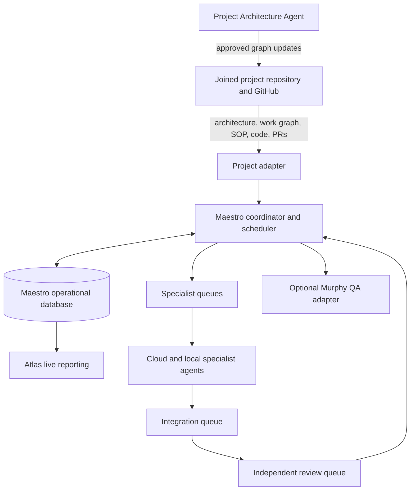
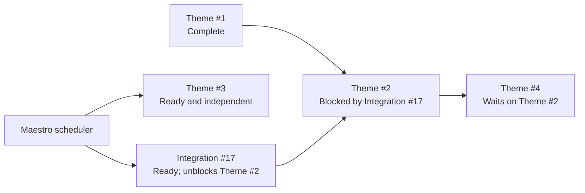
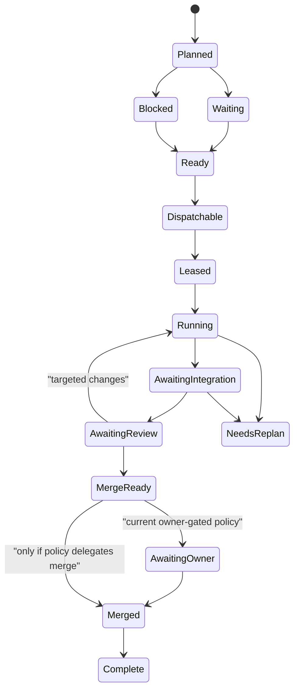

# Agent Workforce Control Plane

**Status:** M0 planning design. This document expands the Maestro master plan; it does not authorize a runtime, worker, automatic merge, deployment, or a change to a joined project's engineering policy.

## 1. Purpose

Maestro is to become an agent-driven development organization, not a collection of isolated coding prompts. Its purpose is to keep several specialist agents productively and safely working from an approved architecture and delivery plan while making the work, waits, evidence, model routing, and owner decisions visible in Atlas. Agent capacity is the workforce capacity; a human owner retains the product, architecture, and delegation decisions that the project has not explicitly assigned to Maestro.

The design has four deliberate separations:

1. **Architecture meaning** belongs to the project's Architecture Agent and approved project records.
2. **Operational coordination** belongs to Maestro.
3. **Versioned engineering truth** belongs to the joined project's repository and GitHub.
4. **Operational visibility** belongs to Atlas. Maestro performs orchestration under approved project policy; Atlas never becomes a controller, plan editor, or code editor.

This design is project-neutral. A project supplies specialist overlays, architecture sources, its SOP binding, and its work graph through its Maestro adapter.

## 2. Decisions captured from the agent-workforce planning conversation

| ID | Decision |
|---|---|
| AW-00 | The development organization is agent-driven. Human involvement is for owner approval, policy, and delegated authority—not routine staffing of each specialist lane. |
| AW-01 | Every role has a versioned role contract. A role contract is an operating brief for a fresh agent instance; it is not a permanent chat personality. |
| AW-02 | Generic control roles live in Maestro. Project-specific specialist overlays live with, or are referenced by, the joined project. |
| AW-03 | A project's Architecture Agent reads its approved architecture, current source, handoff, and decision records; after owner approval it updates the project's versioned architecture/work-graph records. It does not silently authorize product code. |
| AW-04 | Each specialist has a planned, dependency-aware work queue. It contains ready, blocked, waiting, running, integration, review, complete, and replanning work—not only work that can run immediately. |
| AW-05 | Maestro derives dispatchable work from specialist queues. It selects the highest-ranked eligible item; it does not require strict FIFO idling when a later item is independent. |
| AW-06 | Parallelism is designed in from the beginning: run independent work in parallel and serialize only declared dependencies, shared boundaries, or finite resources. |
| AW-07 | Integration is a specialist queue. Integration work is deliberately prioritized when it unblocks downstream capacity. |
| AW-08 | Atlas is the live reporting interface for queues, runs, routing, capacity, evidence, and approvals/status. It has no orchestration commands. |
| AW-09 | Every coding agent follows one project-bound Coding Agent SOP. A specialist overlay may add rules but may never weaken the SOP. |
| AW-10 | Independent review occurs at meaningful merge boundaries and before a high-risk shared boundary becomes a dependency; it is not required after every microscopic internal step. Every mergeable PR remains independently reviewed by someone other than its author. |
| AW-11 | The long-term target is for Maestro to select the next approved work and, where a project explicitly delegates it, merge a fully gated result. Current project policies continue to control owner acceptance, merge, and next-milestone authority. |
| AW-12 | Substantial repository-related architecture and planning conversations default to Codex CLI when practicable so the work can be tied to repository context and measured usage. ChatGPT Work/web remains appropriate when owner interaction, visual work, connected apps, or mobile access provides material value. |
| AW-13 | Architecture, coordination, implementation, review, correction, integration, and QA usage are first-class operational facts. Maestro records measured usage and provenance per controlled run, reconciles it to account-level usage, and reports any remainder as unattributed rather than silently omitting it. |

## 3. Authority and source-of-truth model

| Fact | Authority | Maestro / Atlas behavior |
|---|---|---|
| Product intent, architecture decisions, approved work graph (including planned rank and structural dependencies), project SOP | Joined project repository | Read, validate, project, and link. Atlas never edits these facts directly. |
| Actual task, PR, review, CI, merge, and acceptance records | Joined project's GitHub records under its policy | Link to and observe; do not duplicate them as a hand-maintained Maestro or Atlas task tracker. |
| Agent role contracts and common workflow policy | Maestro repository | Versioned and released with the control-plane process. |
| Operational projection of an approved graph, derived queue eligibility/state, claims, leases, agent runs, attempts, locks, resource reservations, evidence copies, retries, health, notifications, command history, and usage observations | Maestro operational database | Durable, idempotent state controlled by Maestro. It may not independently rewrite the planned specialist backlog or present estimated usage as exact. |
| Atlas live reporting | Maestro operational database | Atlas receives current snapshots and events. It does not issue state-transition commands. |

There must never be two independent writable truths for one fact. For example, a project's approved work graph is stored in that project; Maestro stores the projection it last read and the operational consequences of acting on it.

## 4. System shape

The Linux AI box is the initial runtime for Maestro, its operational database, local workers, disposable verification services, and Atlas. Cloud agents are invoked for planning, high-judgment implementation, integration, and review according to routing policy. Murphy remains a distinct, project-policy-controlled deployed-environment QA capability.

## 5. Role system

### 5.1 Generic Maestro roles

| Role | Owns | Must not do |
|---|---|---|
| Maestro Development Manager | Scheduler, queue transitions, leases, safe dispatch, integration/review routing, recovery, and operational events | Redefine project architecture, silently widen scope, merge or deploy without the project's authorization policy |
| Integration Agent | Integrate compatible worker results, own declared shared boundaries, verify assembled behavior, and decide whether a result is ready for independent review | Approve its own integrated result for merge, silently alter architecture, or bypass an unresolved dependency |
| Independent Review Agent | Review a meaningful merge unit against authority, scope, architecture/security impact, behavior, tests, evidence, and SOP | Review its own authored/integrated work as independent reviewer |
| QA Agent | Run the project-approved QA/acceptance route and return reproducible findings/evidence | Make unreviewed product fixes outside an assigned packet |

### 5.2 Project Architecture Agent

The Architecture Agent is a project-specific planning role. It receives a project handoff plus an explicit discussion subject, such as a VennueSign Content Platform Architecture Renewal question. It must:

1. Read the role contract, project adapter, approved architecture/design sources, current source map, handoff, decisions, and current repository state required by the project.
2. Mine existing rulings before asking an owner to repeat known facts.
3. Turn a discussion into versioned decisions, questions, work-graph nodes, dependencies, safe parallel slices, or explicit deferrals.
4. Present genuine unresolved product/architecture decisions with facts, options, a recommendation, and impact.
5. Propose updates only on the adapter-declared planning paths; required project review/approval and merge make a graph release active.

It owns the **meaning and shape** of future work. Maestro owns the **operational selection and movement** of approved work.

### 5.3 Specialist agents

A specialist is defined by a project overlay such as Content Platform, Theme Studio, Display Runtime, Screens, Connector Platform, or another architectural boundary. Each overlay states its authority paths, allowed paths, prohibited boundaries, owned invariants, expected outputs, queue routing class, and escalation triggers.

An actual model is not the role. Routing can change a Theme Studio packet from one eligible cloud model to another without changing the role contract or historical evidence.

## 6. Work graph and packet model

### 6.1 Work graph

The project Architecture Agent maintains an approved directed graph. Every active graph release names its `project`, `graphRevision`, `authorityRef`, and `sourceBaseSha`. A graph node is an architectural outcome/dependency record with a clear outcome; it is not a duplicate task tracker. An edge says that one item cannot safely begin or complete before another reaches a declared gate.

Every node includes:

- stable ID, project/workstream/milestone reference, and linked actual task record (for example, a GitHub Issue carrying the same `architectureNodeId`);
- title, outcome, non-goals, owner-approved priority, planned queue rank/serial band, and allowed out-of-order semantics;
- specialist role and eligible execution classes;
- typed upstream dependencies (`hard`, `review-before-consume`, `serial`, or `advisory`) and downstream work it unlocks;
- architecture-level change domains and shared-boundary lock claims; exact allowed/forbidden paths belong to the later packet;
- required input contract/version and expected output contract/version;
- required checks, evidence, reviewer route, and integration route;
- resource requirements and concurrency limits;
- planning authority and approval state.

Before a graph release becomes active, its validator rejects cycles, missing references, unresolvable locked-boundary conflicts, missing reviewer/route definitions, and invalid ordering declarations. The graph is the source from which visible planned specialist queues are projected. It is not duplicated as a manually maintained Atlas backlog.

An active node's packet scope is immutable. A material source, contract, priority, or boundary change creates a superseding node and linked task record; it does not silently mutate a worker's live assignment. When a relevant source changes after `sourceBaseSha`, the adapter marks affected work `NeedsReplan` until it is reconciled against an active superseding revision.

### 6.2 Packet

A packet is the execution form of one graph node or an intentionally cohesive group of small dependent steps. A packet is large enough to be a meaningful review unit and small enough to have a clear ownership boundary.

A packet materializes an active graph node for one isolated run. It includes the graph revision and authority reference, project SOP version, role-contract version, base commit, expected branch, exact allowed/forbidden paths, task-specific context, acceptance behavior, validation commands, evidence format, timeout, retry policy, model route, resource claims, and independent reviewer route.

## 7. Dependency-aware specialist queues

Each role has a **planned queue**, not merely a list of currently executable jobs. The queue makes future demand and blocked capacity visible. It is a projection of approved nodes assigned to that role, in their approved rank/serial order; it is not a database-authored backlog.

### 7.1 Queue entry state

| State | Meaning |
|---|---|
| Planned | Owner-approved work already visible in the specialist's planned queue, but not released by a declared planning/serial gate. Unapproved or deferred proposals are outside the queue. |
| Waiting | Ordered work whose earlier same-role dependency or planned release gate has not opened. |
| Blocked | Cannot start because a named hard dependency, contract, integration result, decision, required route, or environment is unavailable or invalid. A temporary WIP/resource-contention wait remains `Ready` but not `Dispatchable`. |
| Ready | Its planning and hard-dependency gates are satisfied. It may await a currently free resource, WIP slot, or permitted execution route. |
| Dispatchable | `Ready` plus a compatible current source/interface state, an allowed route, and available WIP/resources. It can acquire an atomic lease now. |
| Leased | An eligible agent has exclusively claimed the packet but has not begun its recorded run. |
| Running | The agent is executing in an isolated worktree/environment. |
| AwaitingIntegration | Worker evidence is complete; an Integration Agent must assemble, validate, or explicitly sign off. |
| AwaitingReview | A coherent merge unit is ready for independent review. |
| MergeReady | Independent review and required gates passed; the result may proceed only through the project's branch/merge policy. |
| AwaitingOwner | Project policy requires owner acceptance or an owner-performed merge action. |
| Merged | The merge is observed on the authoritative project/default branch and its result is reconciled. |
| Complete | The required post-merge/downstream gate has passed and the result has been reconciled. |
| NeedsReplan | A changed fact, failed architecture assumption, or irreconcilable conflict requires Architecture Agent or owner action. |
| Cancelled | Deliberately stopped with a recorded reason. |

### 7.2 Scheduled work is not strict FIFO

Each entry has a rank, but the scheduler chooses the highest-ranked **dispatchable** entry. A blocked Theme Studio item does not automatically idle the Theme Studio agent if a later Theme Studio item is independent and explicitly permitted to run before it. Atlas always shows the full planned queue separately from its filtered dispatchable subset.

In this example, Maestro can dispatch Theme #3 and promote Integration #17. It must not dispatch Theme #4 until Theme #2 completes.

### 7.3 Queue priority and unblocking

The scheduler considers, in order:

1. declared dependency and release-gate correctness;
2. owner-approved priority and milestone order;
3. downstream capacity unlocked by completing an item;
4. risk and shared-boundary urgency;
5. agent/model eligibility, resource availability, and queue WIP limit;
6. age/fairness among equally eligible work.

It may elevate an Integration Agent item because it unblocks several specialists. It may not silently reorder work across an owner-declared priority boundary.

### 7.4 Eligibility, leases, and recovery

Maestro recomputes the projection on an approved graph revision, a poll/reconciliation observation, a worker/CI/review event, or a lock or lease expiry. A packet is Dispatchable only when its graph and linked task are active, every hard/review gate is passed, its base and required interface are compatible, no hold/budget policy blocks it, its route is allowed, and its WIP/resource/path/shared-boundary claims are available.

Lease creation reserves the packet's lease and all required locks atomically and idempotently. A lease records its base commit, run fingerprint, worktree, TTL, and heartbeat. On restart, timeout, duplicate event, or stale completion, Maestro rereads repository and operational facts before making another transition; an expired lease never blindly creates a duplicate run.

### 7.5 Target operational records

M0 defines the record boundaries, not their database implementation. The operational database will need at least the following projections and evidence records:

| Record | Purpose |
|---|---|
| Project binding / process version | Registered repository, adapter revision, allowed exceptions, and bootstrap/register outcome |
| Graph projection | Exact project graph revision, authority reference, source hash, node/Issue links, and stale/replan status |
| Specialist queue entry | Derived planned rank, current state, blocker explanation, and dispatchability calculation |
| Agent capability / route | Eligible executor class, health, qualification, policy version, availability, and factual selected model |
| Lease and resource reservation | Atomic claim, worktree, TTL/heartbeat, path/shared-boundary/resource locks, and recovery history |
| Dispatch decision | Scheduler inputs, selected work, skipped higher-ranked work, and transparent reason |
| Integration batch / review unit | Compatible inputs, integration branch, verification, reviewer route, gate result, and findings |
| Coordinator event audit | Observed or coordinator-performed transition, idempotency key, before/after state, scope, result, and reason |

`project create` bootstraps a new project against a versioned central-process binding. `project register` is non-destructive: it binds an existing project to that process, records its declared exceptions, and proves repository/branch/PR/check/report behavior with a dry run before any real dispatch.

## 8. Parallelism, locks, and integration

### 8.1 Parallel by default

Independent work runs concurrently when all of the following are true:

- both packets are Dispatchable;
- their declared owned paths and shared boundaries do not conflict;
- neither requires an exclusive contract, migration, fixture, environment, or resource already leased;
- each has an eligible agent and validation path;
- the project adapter permits the concurrency.

### 8.2 Explicit serialization

The following are serialized until a project adapter declares otherwise:

- architecture decisions and unresolved domain rules;
- shared contracts, database migrations, dependency injection/composition, common fixtures, build workflows, and other declared shared boundaries;
- integration and final merge for a coherent result;
- a finite local resource such as the current Linux AI box's heavy local-model inference or a non-isolated verification target.

Locks are data, not convention. A packet declares the lock it needs; Maestro leases and releases it idempotently. Locks cover paths as well as semantic shared contracts, schema/migration, dependency injection/composition, common fixtures, workflows, integration branches, deployment/test environments, local inference/GPU, verification gates, and secret/environment use. A job that cannot obtain the lock is shown as waiting with the current holder and expected release condition.

### 8.3 Integration queue

Integration is a first-class specialist queue. Worker completion creates an integration entry with the worker branch, base/result commits, changed paths, evidence, dependency outputs, and expected integration mode:

- **Validate only:** the packet is isolated, all checks pass, and integration verifies readiness before review.
- **Assemble:** compatible worker outputs need a controlled integration branch or shared-boundary change.
- **Replan:** an integration conflict reveals that the work graph or packet boundary was incomplete.

If an Integration Agent changes code, its assembled result proceeds to an Independent Review Agent that did not author or integrate that result.

### 8.4 Target packet lifecycle

The current V1 lifecycle is the intentionally smaller single-worker subset of this target lifecycle. M0 documents it only.

## 9. Coding Agent SOP and verification policy

Every coding packet binds this hierarchy:

1. Joined-project engineering policy and SOP (for example, that project's `AGENTS.md`).
2. Maestro common Coding Agent SOP.
3. Specialist role overlay.
4. Packet-specific instructions.

Maestro's SOP is a mandatory common safety floor. The joined project remains the authority for its engineering rules; a project, specialist overlay, or packet may add stricter requirements but may not relax an earlier applicable requirement.

### 9.1 Required preflight

Before execution, the worker must verify and record:

- exact base commit, clean isolated worktree, and repository instructions;
- approved authority and packet approval state;
- required current handoff and decision/source paths;
- allowed/forbidden paths and current locks;
- required inputs, dependencies, environment policy, and validation commands;
- role/SOP/packet version identifiers.

### 9.2 Required handoff

Before a packet may enter Integration, it supplies:

- branch and commit identifiers;
- changed-file list and scope check;
- executed commands and verbatim result/evidence;
- screenshots or interaction evidence when the project requires it;
- declared `PASS`, `N/A (reason)`, or `UNTESTED` result for every relevant completion check;
- known gaps, risks, rollback/recovery information, and downstream contract output.

### 9.3 Review is proportionate to risk

Workers self-check internal steps. Independent review is required:

- before downstream workers depend on a high-risk contract, migration, security/identity boundary, or architecture decision;
- for every mergeable PR or equivalent merge unit, by someone other than its author;
- after Integration when the Integration Agent changed the result.

Small scaffolding work may fold into the next substantive review unit. The system must never claim independent review happened when only the author or integrator checked it.

## 10. Atlas live reporting

Atlas becomes the live owner-facing reporting interface over Maestro state. It remains a projection only, not a controller or a second source of project design or code truth.

### 10.1 Required views

| View | Required information |
|---|---|
| Work graph | Project/workstream hierarchy, dependencies, unlocked work, planning authority, and source links |
| Specialist queues | Ordered current/future work, state, rank, blockers, upstream/downstream links, WIP, and next eligible item |
| Integration and review | Incoming branches/PRs, assembly requirements, review route, evidence, age, and unblock effect |
| Agent workforce | Role, model route, location, health, current lease, queue depth, and available capacity |
| Resources | Locks, worktrees, local GPU/verification reservations, environments, timeouts, and expected release |
| Decisions | Owner-facing genuine questions with known facts, options, recommendation, impact, and linked authority |
| Evidence and metrics | Tests, reviews, retries, time-to-ready, time blocked, first-pass acceptance, cost/model facts, and history |

### 10.2 Read-only boundary

Atlas does not start, pause, resume, cancel, retry, reassign, reprioritize, route, approve, merge, or otherwise control Maestro work. It shows the latest recorded state, including the factual agent/model route, capacity, waiting reason, expected next action, evidence, and project/owner gate.

Maestro performs coordination only under approved project policy. The owner gives product, architecture, policy, and approval direction outside Atlas. Atlas must not expose agent prompts, traces, credentials, or secrets.

## 11. Model routing and capacity

Role and model are separate. A routing policy maps packet risk, role, task type, resource needs, and project rules to eligible execution classes. It records both the planned route and the factual model/runtime used.

Initial VennueSign-oriented routing remains compatible with the current qualification evidence:

- local models: bounded, settled, repository-contained implementation, tests, fixtures, documentation, and mechanical work;
- cloud agents: planning, architecture, contracts, integration, high-judgment fixes, and independent review;
- one heavy local inference job at a time until measured capacity shows that concurrent inference and verification are safe;
- default WIP of one active packet per specialist role, raised only by explicit project/role policy and observed safe capacity.

Atlas shows model and concurrency facts. Routing and concurrency policy changes occur through the approved Maestro/project planning process, not Atlas.

### 11.1 Agent executor adapter and service-account boundary

Each local or cloud executor is reached through an executor adapter with a versioned capability contract: `submit`, `observe/poll`, `cancel`, retrieve evidence, and optionally receive a signed event/webhook. Cloud reasoning may choose an eligible executor, but the Linux-hosted Maestro service account performs the durable coordinator actions and owns no broader permission than necessary.

The service-account baseline is least privilege: protected branches remain protected; workers receive only scoped repository and environment access; production credentials are unavailable by default; credentials are referenced rather than embedded in packets or Atlas; webhook signatures, source, replay, and expiry are verified. Polling/reconciliation remains the recovery authority even when a webhook is available.

## 11.2 Agent usage observability and architecture work surfaces

### Operating rule

Substantial repository-related architecture and planning conversations default to
Codex CLI when practicable. The default exists because local Codex clients can
associate the session with the repository and expose structured token telemetry,
allowing Maestro to attribute consumption to the architecture work that caused it.

ChatGPT Work/web remains an intentional work surface when it provides a material
advantage, including rapid owner discussion, visual work, connected apps, or mobile
access. Those conversations still consume the shared ChatGPT Work/Codex allowance
and must be registered as architecture, planning, coordination, or another honest
work category. They are not free or excluded merely because exact per-conversation
telemetry is unavailable.

Do not repeat an entire conversation on both surfaces merely to manufacture
measurement. Preserve the accepted result in the versioned planning record and
record the measurement provenance honestly.

### Required usage record

Every controlled agent or architecture run receives a stable Maestro job ID. A run
may also link to a parent job, graph node, packet, review finding, correction, or
integration batch. Its usage record contains:

- role and work category: architecture/planning, coordination/packet preparation,
  implementation, Decision Fidelity Review, Independent Implementation Review,
  correction/follow-up review, integration, QA, or general/unattributed work;
- execution surface and location: Codex CLI, local Codex client, ChatGPT Work/web,
  Codex cloud, API-key worker, or other approved adapter;
- project, repository, branch/worktree where applicable, job ID, parent ID, thread
  or conversation identifier, start/end time, and outcome;
- factual model, reasoning level, speed/service tier, authentication/billing mode,
  agent role, and subagent/child-run relationship;
- input tokens, cached-input tokens, output tokens, and separately reported
  reasoning-token detail when the execution surface exposes them;
- calculated credit estimate, rate-card identifier/effective date, calculation
  version, and whether the value is measured, estimated, account-delta-only, or
  unavailable;
- retry, stalled-run, correction, review-renewal, and first-pass-acceptance facts;
  and
- the applicable account-usage observation used for weekly reconciliation.

Prompt and source contents are redacted from telemetry by default. Maestro stores
the minimum identifiers and aggregates needed for attribution; Atlas must never
display secrets, raw prompts, private reasoning traces, or source-code snippets
from telemetry.

### Capture sources and provenance

- Non-interactive Codex runs should use `codex exec --json`; the final
  `turn.completed.usage` object provides input, cached-input, output, and reasoning
  token facts.
- Interactive local Codex clients should export OpenTelemetry events; token counts
  are captured from `response.completed` events and correlated to the Maestro job
  through the conversation/thread identifier.
- Account-level `/usage weekly`, `/status`, or the ChatGPT usage dashboard provides
  the reconciliation observation supported by the active account and surface.
- A ChatGPT Work/web conversation without supported per-conversation telemetry is
  still registered with its role, model/reasoning choice when known, timing,
  purpose, and outcome. Its usage provenance is `account-delta-only` or
  `unavailable`; Maestro must not scrape an unsupported interface or invent exact
  token counts.

OpenAI's current reference points are [Codex non-interactive JSON output](https://learn.chatgpt.com/docs/non-interactive-mode),
[Codex observability](https://learn.chatgpt.com/docs/config-file/config-advanced),
[usage commands](https://learn.chatgpt.com/docs/developer-commands), and the
[ChatGPT Work/Codex rate card](https://learn.chatgpt.com/docs/pricing). The
implementation must version the rate card instead of treating today's rates as
permanent.

### Weekly reconciliation

For each account and allowance window, Maestro preserves the raw account observation
and calculates:

`tracked controlled usage + tracked web/task usage + unattributed usage = observed account usage change`

If the account surface reports only remaining percentage or another coarse value,
Maestro stores that exact observation and its precision rather than converting it
into false token accuracy. Concurrent work may make an account-level delta
impossible to assign to one conversation; the remainder stays visibly unattributed.

### Atlas reporting

Atlas adds read-only views for:

- weekly allowance pace and remaining account observation;
- usage by project, work category, agent role, model, reasoning level, and surface;
- architecture/planning versus implementation, review, correction, integration,
  and QA consumption;
- parent runs and subagent/child-run consumption;
- first-pass accepted work, failed/stalled work, corrections, targeted follow-ups,
  and renewed full reviews;
- cached-input share, context growth, and measured versus estimated provenance;
- usage per accepted packet or completed planning outcome; and
- the unattributed reconciliation remainder.

These metrics diagnose where capacity is going. They do not weaken Decision Fidelity
Review, Independent Implementation Review, evidence gates, owner acceptance, or
model-quality requirements. Maestro may recommend a smaller model, narrower context,
or tighter packet, but cost data alone never authorizes rerouting or reduced
assurance.

### Phased implementation boundary

- **V1:** capture measured usage and provenance for the one controlled loop whenever
  its execution surface exposes them; prove that one run is tied to its Maestro job.
- **V2:** make usage a durable per-run operational record, include architecture and
  review categories, link parent/child runs, reconcile the weekly observation, and
  expose the first read-only Atlas usage views.
- **V3:** add baselines, trends, budget/pace warnings, efficiency retrospectives, and
  evidence-based routing recommendations. Numeric thresholds require separate
  owner-approved policy.

Implementation is not authorized by this planning section. Exact personal-plan
usage ingestion remains limited by the reporting interfaces OpenAI exposes; the
design must preserve an honest unattributed bucket rather than depend on unsupported
scraping.

## 12. Project adapter requirements

Every joined project adapter must provide:

- repository/GitHub binding and branch/PR/merge policy;
- authoritative project-policy and SOP paths;
- architecture/work-graph source locations and feature/workstream vocabulary;
- specialist overlays and allowed project roles;
- environment, test, worktree, credential-reference, and resource-lock policy;
- review, owner-acceptance, deployment, and remote-QA policy;
- mapping from project work records to Maestro stable IDs;
- record-sync and conflict-recovery behavior.

The adapter ingests an approved graph revision from the project's default branch at an exact commit; chat, a Library document, a static Atlas page, an old roadmap, or a draft PR alone is never dispatch authority. It projects the graph rather than copying it, retains its source hash, rechecks before lease, and marks affected nodes `NeedsReplan` when a relevant authority or contract changes. Polling/reconciliation remains the recovery authority; webhooks may accelerate observation later.

For VennueSign, the Architecture Renewal is a key source for the project Architecture Agent. It defines the target architecture and safe migration direction; the agent must preserve accepted customer behavior and use approved renewal records rather than treating a stale generic roadmap as authority. The current summary handoff is not enough to dispatch renewal work: before any affected packet is admitted, VennueSign must land a versioned, reviewable renewal-authority bundle in its repository.

VennueSign's actual tasks remain GitHub Issues; a graph node links to its Issue by a stable `architectureNodeId` and never creates a second hand-maintained task list. Until VennueSign deliberately changes its policy, parallelism is limited to explicitly independent packets within one active approved milestone. A successor milestone remains blocked by its current owner-acceptance/merge rules. Current controlled records (including shared contracts, DI, migrations, fixtures, workflows, tracker/status, and handoff) must retain their project-declared owner and lock.

While VennueSign CI is suspended, its adapter must report the actual local verification gate and any `UNTESTED`/skipped CI checks honestly; it must never infer that an unavailable GitHub check passed. Its older proposed broad “Cloud Maestro” framework must be reconciled or superseded in VennueSign before it is used alongside the separate Architecture, Integration, and Independent Review roles defined here.

Before specialist queues become executable for a joined project, its Architecture Agent may propose an AI-friendly source-affordance refactor: clear folder/module boundaries, smaller cohesive units, accurate area maps, stable contracts, and explicit ownership. M0 records this adoption phase only; it does not alter VennueSign code or treat a specialist example overlay as design approval.

## 13. Delivery stages

### M0 — design and consolidation only

M0 records this control-plane design, role-contract structure, queue/scheduler semantics, Atlas live-reporting implications, SOP hierarchy, adapter requirements, traceability, and independent planning review. It does **not** build the coordinator, queue database, Atlas live reporting, or workers.

### V1 — one visible controlled loop

V1 remains intentionally narrow: one registered project, one approved milestone, one hosted worker, one draft PR, verification, independent review, evidence, and an owner acceptance/merge point. It proves the authority and recovery loop, not agent-workforce parallelism. When the execution surface exposes it, V1 also captures that controlled run's token usage and measurement provenance against its Maestro job ID.

### V2 — controlled agent workforce

V2 adds formal role contracts, specialist planned queues, packet ownership/path enforcement, model routing, an Integration Agent, and limited parallel dispatch for explicitly independent work. It makes usage a durable per-run record, includes architecture and review categories, links parent/child runs, and reconciles account-level observations. Atlas gains live queue, routing, capacity, evidence, and usage views backed by Maestro state.

### V3 — mature parallel operations

V3 adds measured concurrency policies, resource-aware scheduling, full live operational reporting views, review/escalation limits, QA hooks, usage baselines and pace warnings, metrics/retrospectives, evidence-based routing recommendations, and Linux-native disposable verification required by project adapters.

### Later explicit authority decision — continuous operation

The fully continuous mode in which Maestro replenishes future approved lanes and merges a result is deliberately deferred. It requires a project-specific, reviewed delegation policy for protected-branch/service-account scope, review completion, rollback, notification, owner override, and successor-milestone authority. It is not inferred from V1–V3 or from this documentation merge authorization.

## 14. Acceptance criteria for this planning expansion

This expansion is complete when:

- the master plan points to it and remains consistent with M0/V1/V2/V3 boundaries;
- generic roles and specialist-overlay templates are versioned;
- the planned-versus-dispatchable queue distinction is explicit;
- dependency, lock, integration, review, and restart behavior are defined;
- Atlas's read-only reporting boundary is explicit and does not create duplicate truth;
- architecture and agent usage are first-class operational facts with measurement provenance, weekly reconciliation, and a visible unattributed remainder;
- Coding Agent SOP enforcement and proportionate independent review are defined;
- VennueSign Architecture Renewal integration is described without authorizing VennueSign changes;
- independent reviewers confirm that the captured conversation decisions and existing Maestro sources are represented or explicitly deferred.

## 15. Deliberate implementation deferrals

The following remain implementation design questions for later approved stages:

- SQLite table/index/backup implementation and event-retention policy;
- exact Atlas UI technology and authentication boundary;
- webhook transport, because polling remains the initial completion/recovery mechanism;
- exact GitHub App/service-account scopes and cloud-agent invocation provider API;
- numeric concurrency, cost, usage-pace, and queue-aging policy thresholds;
- exact supported ingestion path for personal ChatGPT account-level usage and retention of raw usage telemetry;
- project-specific specialist-role set and model mapping beyond their versioned adapters;
- review-round cap/escalation policy and the future auto-merge/autonomous-next-work delegation boundary.

These deferrals do not weaken the behavioral contract above.
