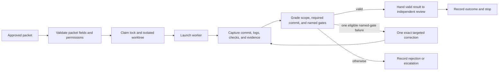

# Maestro Alpha — Decision-Fidelity Review

**Status:** Approved for issuance of one bounded Alpha-01 build packet; no work outside that packet is authorized.
**Reviewer:** Maestro Decision Fidelity Reviewer
**Proposal reviewed:** owner-directed Alpha boundary, 2026-08-29
**Scope:** planning and traceability only. This record creates no runtime, worker, project adapter, project registration, GitHub automation, or external agent dispatch.

## Later amendment boundary

This record is the historical pre-build review that governed the original
Alpha layout and Alpha-01 issuance. Its no-scheduler and no-Integration rows
remain controlling for Alpha-01 through Alpha-03 and are not retroactively
expanded. Owner-accepted
[M0-D13](decisions/m0-d13-synthetic-control-loop-qualification.md) adds a later,
separately reviewed Alpha-04 exception for one fixed fixture-only control-loop
qualification before Foundry V1, including replay of fixed role observations
past the earlier review-handoff stop. Maestro does not generate those actor or
review judgments. M0-D13 authorizes planning only; Alpha-04 still requires its
own planning review, merged graph release, execution packet, packet review, and
explicit implementation release.

## Controlling records

This review used the current `master` records, in this order when a rule is more specific:

1. [Maestro Master Plan](maestro-master-plan.md)
2. [Agent Workforce Control Plane](agent-workforce-control-plane.md)
3. Accepted M0 decisions in [decisions/](decisions/)
4. [M0 Source Inventory](m0-source-inventory.md)
5. [Current Handoff](../../ai/handoffs/current.md)

The review applies the [Decision Fidelity Reviewer](../agents/decision-fidelity-reviewer.md) contract. The owner's Alpha direction is binding: synthetic fixtures only; no Foundry or VennueSign work; no project adapters, GitHub automation, real agent dispatch, or RunPod use.

### Deliberately small Alpha layout

```text
apps/atlas/                         local, read-only React/TypeScript UI
services/maestro/                   one Python service
  maestro/
    packet_contract.py              validate approved packet and permissions
    packet_wrapper.py               bounded local wrapper lifecycle
    lifecycle.py                    durable state transitions and evidence
    storage.py                      SQLite access; the only database writer
    api.py                          snapshot and event-stream read API
    cli.py                          includes `maestro run-packet`
fixtures/alpha/                     synthetic fixtures only
tests/                              unit, integration, and lifecycle evidence tests
scripts/                            local run, test, backup, and restore helpers
var/                                ignored SQLite, logs, evidence, and sockets only
docs/architecture/                  Alpha contracts and boundaries
docs/operations/                    local operation and recovery instructions
```

There are no separate coordinator/read-API services, shared-package folders, or Foundry/VennueSign adapters in Alpha.

### Mandatory `maestro run-packet` boundary

`services/maestro/` must expose exactly one packet-wrapper entry point: `maestro run-packet`. It receives an already approved packet and is prohibited from deciding product/design choices, merging, selecting a successor packet, or bypassing the Decision Fidelity Reviewer.



The correction edge is permitted only for committed, in-scope work that fails a named gate. The wrapper records and stops after its review handoff; independent review, merge, and later dispatch remain separate authority-bound actions.

## Traceability table

`Included` means the cited Alpha component and planned test/evidence are required before build approval. It does not claim that code already exists.

| Accepted choice | Alpha carrier: component, test, or evidence | Status | Exact resolution for a non-included row |
| --- | --- | --- | --- |
| C-01 project-neutral Maestro | Adapter-free layout; synthetic-fixture boundary test | included | — |
| C-02 Linux-first AI-box operation | Python service, loopback API, operations guide; Linux smoke test | included | — |
| C-03 SQLite operational memory | `storage.py`, WAL/migration test, ignored `var/` database | included | — |
| C-04 local Atlas over Maestro state | `api.py` snapshot/SSE contract; Atlas API-only integration test | included | — |
| C-05 repository/GitHub retain engineering authority | Fixture-only, adapter-free boundary; no repository write path | included | — |
| C-06 database owns operational state | Lifecycle, storage, evidence, wait, and event records; persistence test | included | — |
| C-07 no two writable truths | Atlas has no write route or SQLite access; API contract test | included | — |
| C-08 project-specific adapters | No adapter directories or external project records | approved deferral | Keep adapter work in post-Alpha onboarding only. |
| C-09 shared lifecycle/evidence/lock rules | Packet contract, wrapper, lifecycle records, and wrapper tests | included | — |
| C-10 create/register project flows | No registration command or project binding | approved deferral | Keep project bootstrap/register outside Alpha. |
| C-11 Project Foundation before feature work | Alpha has no joined project or feature plan | approved deferral | Enforce it at first project onboarding. |
| C-12 constrained planning records | Packet contract validates approval, fidelity evidence, routing, checks, and owner gate | included | — |
| C-13 planning conversation capture/checkpoints | This durable review and fixture provenance field | included | — |
| C-14 source-to-record traceability | This table and its acceptance checklist | included | — |
| C-15 plain task subjects | Packet contract requires concise `title`; validation test | included | — |
| C-16 planned route/reviewer plus factual facts | Packet contract, attempt/evidence record, Atlas route fixture | included | — |
| C-17 bounded local-worker work | Wrapper accepts a synthetic local executor only; no real model invocation | included | — |
| C-18 cloud planning/review work | No cloud invocation or credentials | approved deferral | Add only with accepted provider/credential design. |
| C-19 durable visible waiting state | Wait projection, snapshot/SSE schema, Atlas waiting-state test | included | — |
| C-20 polling before webhooks | No external completion source exists | approved deferral | Specify polling reconciliation before any real executor. |
| C-21 idempotent recovery | Idempotency/terminal-outcome contract; duplicate-event and restart tests | included | — |
| C-22 one milestone then owner gate | Wrapper permits one approved packet and stops after review handoff | included | — |
| C-23 Murphy is separate/manual QA | No Murphy integration, Azure access, or remote-QA route | approved deferral | Preserve manual policy for its later design. |
| C-24 Murphy input/output contract | No deployed target or credential reference accepted | approved deferral | Define only in a future Murphy adapter plan. |
| C-25 M0 contained no runtime build | This commit is planning only; no application code is staged | included | — |
| C-26 fresh agents use versioned roles | Packet contract records role-contract version; fixture test uses a fixed version | included | — |
| C-27 Architecture Agent owns project meaning | No graph or Architecture Agent execution | approved deferral | Require joined-project authority first. |
| C-28 Maestro manager coordinates operations | Alpha service records synthetic lifecycle only; no scheduler/dispatch | included | — |
| C-29 generic roles plus project overlays | Existing role documents referenced; no specialist overlay | included | — |
| C-30 Atlas is reporting-only | UI reads snapshot/SSE only; no control widgets/write API | included | — |
| C-31 planned versus dispatchable queues | Specialist queues are V2 behavior | approved deferral | Add only with approved graph projection/scheduler. |
| C-32 bypass blocked work only when proven | Alpha cannot select/dispatch a later packet | approved deferral | Require graph/lock eligibility in V2. |
| C-33 designed parallelism with locks | Wrapper claims one lock/worktree; no parallel dispatch | included | — |
| C-34 Integration is a first-class queue | Alpha makes only a review handoff; no Integration queue | approved deferral | Add before multi-packet execution. |
| C-35 common Coding Agent SOP | Packet validation requires SOP/authority references; absence is rejected | included | — |
| C-36 proportional independent review | Valid wrapper result creates non-bypassable review handoff record | included | — |
| C-37 Atlas shows factual route/capacity | Synthetic route, lease, and resource fields in snapshot/UI fixture | included | — |
| C-38 source-affordance proposal | Alpha does not inspect project source | approved deferral | Consider in project architecture work only. |
| C-39 VennueSign renewal authority | VennueSign is outside Alpha | approved deferral | No Alpha action. |
| C-40 VennueSign active-milestone policy | VennueSign is outside Alpha | approved deferral | Preserve project policy unchanged. |
| C-41 VennueSign GitHub task authority | No GitHub sync or VennueSign connection | approved deferral | Preserve in any future adapter. |
| C-42 explicit merge/next-work policy | `maestro run-packet` has no merge/successor-dispatch action | included | — |
| M0-D01 SQLite, service-only writer, read API/SSE | `storage.py`, `api.py`, Atlas API-only test, loopback operations | included | — |
| M0-D01 Atlas command boundary | M0-D01 amendment removes `command_requests`; Atlas has no command API and local wrapper entry is `maestro run-packet` | included | — |
| M0-D02 read-only discovery and binding PR | No discovery, manifest, or binding command | approved deferral | Keep onboarding outside Alpha. |
| M0-D03 least privilege/no secret retention | No credentials/integrations/secret fixture fields; secret-rejection test | included | — |
| M0-D04 durable Slack notifications for V1 | No unattended external operation or Slack connection | approved deferral | Implement with V1 unattended operation. |
| M0-D05 tested escalation/routing rule | Mandatory `maestro run-packet`; scope/commit/gate/one-correction tests | included | — |
| M0-D06 thin project binding | No project manifest or adapter | approved deferral | Add only in registration milestone. |
| M0-D07 USB backup/retention/restore | Backup-health support, safe snapshot, and restore-test contract; accepted physical-provisioning deferral | approved deferral | Recovery acceptance stays blocked until documented mount/ownership plus real backup/restore evidence. |
| M0-D08 VennueSign archive boundary | VennueSign is not accessed | approved deferral | No Alpha action. |
| M0-D09 VennueSign fresh reporting | Generic Atlas UI is not a VennueSign view | approved deferral | No reuse/migration without a later decision. |
| M0-D10 Foundry V1 proof | Foundry is not inspected, registered, or changed | approved deferral | Refresh discovery only after Alpha acceptance and explicit release. |
| Decision Fidelity Reviewer gate | This review, owner resolutions, final reviewer sign-off before build packet | included | — |
| Owner-selected React/TypeScript Atlas | `apps/atlas/`; snapshot/SSE consumer build and read-only UI test | included | — |
| Owner-selected one Python service | `services/maestro/` internal modules only; boundary test | included | — |
| Owner-selected synthetic-only Alpha | `fixtures/alpha/` provenance requirement; rejection test | included | — |
| Owner-selected ignored `var/` scope | Ignore rule permits DB, logs, evidence, sockets only; hygiene test | included | — |

## Resolved conditions and remaining gate

1. **D01 resolved.** M0-D01 now expressly removes the obsolete
   `command_requests` row. Atlas is strictly read-only and never calls a
   command API; the Alpha synthetic wrapper is local `maestro run-packet`.
2. **D07 deferred with a hard acceptance gate.** The physical USB drive is
   approved but unattached/unconfigured. Backup-health support may be built,
   but Alpha recovery acceptance remains blocked until the documented mount,
   real backup, and isolated restore test pass.
3. **Limited build authority.** The owner approved the Alpha layout on
   2026-08-30 and a fresh Decision Fidelity Reviewer approved this review at
   `5fc4b61`. One separately authored Alpha-01 build packet may now be issued;
   no work outside that packet is authorized.

## Pre-build acceptance checklist

- [x] M0-D01 `command_requests` is removed; Atlas is read-only.
- [x] M0-D07 physical USB provisioning is explicitly deferred with a recovery-acceptance gate.
- [x] Owner approved the Alpha layout and wrapper boundary on 2026-08-30.
- [x] A fresh Decision Fidelity Reviewer approved the current `master` review after fast-forwarding to `5fc4b61`; every row is `included` or an explicit approved deferral.
- [x] [Alpha-01 — Establish Local Foundation](packets/alpha-01-local-foundation.md) is authored. It remains non-executable until a fresh Decision Fidelity Reviewer approves that packet.
