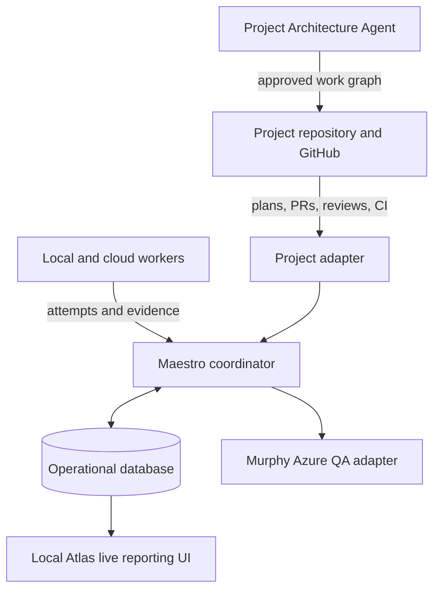
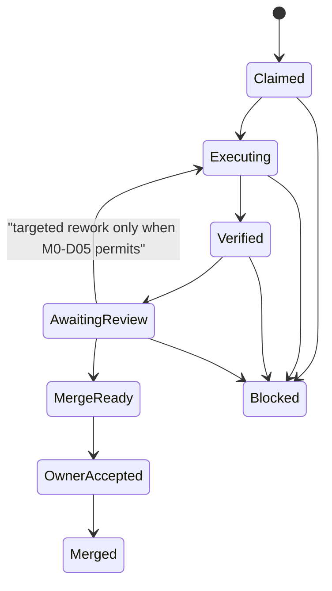

# Maestro Master Plan

## 1. Charter

Maestro is a standalone, project-neutral development-operations system. It is not a product feature of Foundry, Vennue, or any other individual repository.

Its job is to make AI-assisted engineering work visible, structured, recoverable, and governed. It turns one owner-approved milestone into a controlled result with explicit task ownership, evidence, independent review, and an owner acceptance point.

Maestro does not replace a project's architecture, product decisions, or engineering rules. A project joins Maestro through an adapter and declares its own repository, environments, commands, exceptions, and authority policy.

The detailed agent-workforce, specialist-queue, Atlas live-reporting, SOP, and parallel-scheduling design is [Agent Workforce Control Plane](agent-workforce-control-plane.md). Its source coverage is recorded in [M0 Source Inventory and Capture Register](m0-source-inventory.md). These are M0 planning expansions and are authoritative for those concepts where they do not conflict with this master plan.

## 2. Operating principles

1. Project plans and code remain versioned in their own repositories.
2. Maestro keeps durable operational memory: what it observed, what is running, what is blocked, what evidence exists, and which action is safe next.
3. There must never be two independently writable truths for the same fact.
4. A known wait is shown immediately: who is running, when it began, what result is awaited, its timeout, and the next permitted action.
5. A worker may not silently redesign a plan. Missing information becomes a tracked question or proposal.
6. Conversation is valid planning input, but never the only record. Every source item must be captured and traced.
7. Local models do bounded, well-specified work. Cloud models do planning, contracts, integration, high-judgment work, and independent review.
8. Maestro begins Linux-first on the AI box. Windows is used only where a target or tool genuinely requires it.
9. Parallelism is designed, not assumed: independent work may run together; dependencies, shared boundaries, and finite resources are explicitly serialized.
10. Every coding agent follows the joined project's SOP plus the Maestro Coding Agent SOP. Specialist roles may add rules but cannot weaken either.
11. Planned queue order and structural dependencies come from an approved project graph; Maestro derives operational eligibility and may never rewrite that backlog by itself.
12. Any future auto-merge or autonomous next-work authority is explicit, project-bound, reviewed, and revocable; it is not implied by scheduling.

## 3. System shape

### Responsibilities

| Component | Responsibility |
|---|---|
| Project repository / GitHub | Product and engineering records, code, PRs, reviews, CI, approved plan artifacts |
| Maestro coordinator | State transitions, locks, dispatch, recovery, evidence collection, notifications, gate enforcement |
| Operational database | Initial SQLite on the Linux AI box; runs, task/graph projections, packets, attempts, events, evidence, waits, retries, notifications, projected GitHub facts |
| Local Atlas | Live operational reporting for the AI box: queues, routing, status, evidence, blockers, waits, and capacity. It is not a controller, plan/code editor, or direct database client. |
| Project adapter | Project-specific branch policy, commands, environments, credentials references, records, and exceptions |
| Murphy adapter | Manual, owner-approved remote QA against deployed Azure environments |

## 4. Durable state model

Every run and packet has durable state. The initial milestone lifecycle is:

Transitions are idempotent. After restart, duplicate poll, stale completion, or timeout, Maestro rereads the authoritative repository and database facts, then performs only the next safe action exactly once.

## 5. Planning and traceability model

Before implementation, each project passes a Project Foundation stage defining purpose, non-goals, architecture boundaries, environments, release policy, quality baseline, roles, security constraints, and the decision boundary between design and implementation.

Every feature then uses the same constrained records:

| Record | Required contents |
|---|---|
| Feature brief | Outcome, non-goals, users, acceptance, owner, approval |
| Question | ID, exact question, owner, status, resolution/evidence |
| Decision | Context, options, choice, reason, consequences |
| Milestone | Plain subject, outcome, exit condition, dependencies, risks |
| Packet / task | Plain subject, outcome, owned paths, interfaces, invariants, behavior paths, checks, executor route, reviewer route |
| Coverage | Every required path mapped to a check or `UNTESTED` with a reason |

The planning intake process is mandatory:

1. Register every supplied document, archive, existing record, issue, and planning-session capture.
2. Extract atomic requirements, decisions, constraints, questions, task candidates, and deferrals.
3. Produce checkpoint deltas during planning: recorded decisions, new requirements, changed tasks, open questions, deferrals, and source coverage.
4. Run an independent completeness audit before the plan is ready.
5. Require every source item to link to a requirement, decision, task, question, explicit deferral, or not-applicable record.

## 6. Task presentation and routing

Every task has a plain action-oriented title suitable for an owner to scan, for example: `M1-02 · Establish control base and default skin`.

Its supporting record must already state:

- planned execution location: local, cloud, or remote environment;
- agent role: coordinator, planning, implementation, specification, reviewer, or QA;
- intended model/class;
- independent reviewer route;
- owned paths, acceptance behavior, invariants, and validation commands.

When work begins, Maestro records the factual run instance, model/runtime, timestamps, evidence, retries, and outcome. This does not delay routing; it preserves an honest audit trail if the assigned route changes.

Approved project work is projected into ordered specialist queues. A queue contains planned, waiting, blocked, ready, running, integration, review, and completed work. Maestro dispatches the highest-ranked eligible item, not merely the first item in a strict FIFO list. See the control-plane design for dependency, lock, and integration rules.

## 7. Worker wrapper

A local-worker packet follows the tested escalation and routing rule in
[M0-D05](decisions/m0-d05-rework-review-and-escalation.md). A missing scoped
diff or required commit is an immediate rejection, not rework. Only committed,
in-scope work that fails a named gate receives one targeted correction. Further
non-delivery, missed commit, or scope breach escalates immediately. Dependency,
configuration, and placeholder violations are rejected before review.

Packet enforcement should include path locks, a real-commit check, timeout policy, minimum context gate, per-run model fingerprint, session archive, and serialized resource use against verification gates.

## 8. Murphy integration

Murphy is not a local coding worker. It is a remote QA capability that tests deployed Azure environments.

Its project policy is currently manual / owner-approved. A Murphy run receives the target environment, deployed version or commit, and scoped QA credentials; it produces a report, linked issues where appropriate, and a structured run result stored by Maestro. M0 does not contact Azure or alter that policy.

## 9. Phased roadmap

### M0 — foundation and consolidation

- Create the private Maestro repository and controlled records.
- Capture and trace all source material.
- Define the project-neutral process, planning schema, bootstrap/register contract, and architecture.
- Capture the current agent-workforce conversation and preserve traceability to every source agreement.
- Assess Atlas for migration into local operational reporting.
- Independently audit completeness and obtain owner acceptance.

### V1 — prove one control loop

- Register one project.
- Persist one run in the operational database.
- Show the run in local Atlas.
- Coordinate one bounded worker through a draft PR, verification, and review.
- Stop for owner acceptance and merge.

### V2 — controlled delegation

- Enforce work-packet ownership and routing.
- Dispatch suitable bounded tasks to local models.
- Add formal role definitions, specialist planned queues, Integration routing, and model-routing configuration.
- Allow limited parallel dispatch only for explicitly independent packets with non-conflicting locks and project-adapter approval.
- Add live Atlas queue, routing, capacity, and evidence views from Maestro state.

### V3 — mature automation support

- Independent review policy with owner escalation cap.
- QA hooks, process metrics, and retrospective records.
- Linux-native disposable-container verification when individual project adapters require it.
- Resource-aware scheduling, measured concurrency policies, queue-aging/unblocking metrics, and mature Atlas control-plane views.

## 10. Remaining decisions

1. Fresh reporting-view implementation technology for V1. Its read-only local-service, event-stream, and snapshot-reconnect contract is already decided.
2. Protected-branch/service-account authority, webhook security, budget limits, and the future auto-merge/autonomous-next-work boundary.

## 11. M0 acceptance

M0 is complete only when the source inventory has full traceability, this plan reflects every accepted item or an explicit deferral, the Atlas transition is assessed, the agent-workforce control-plane/role/SOP design is captured, the open-decision register is visible, a current handoff is committed, and an independent planning audit has been reviewed by the owner.
