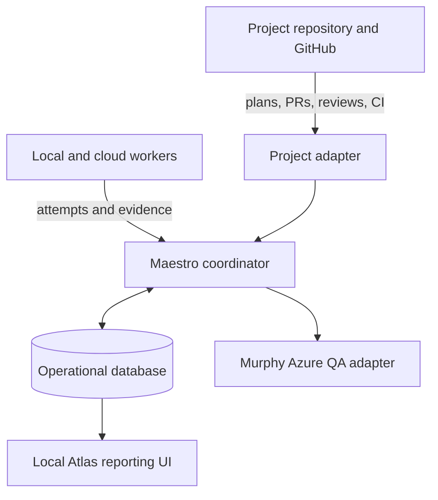
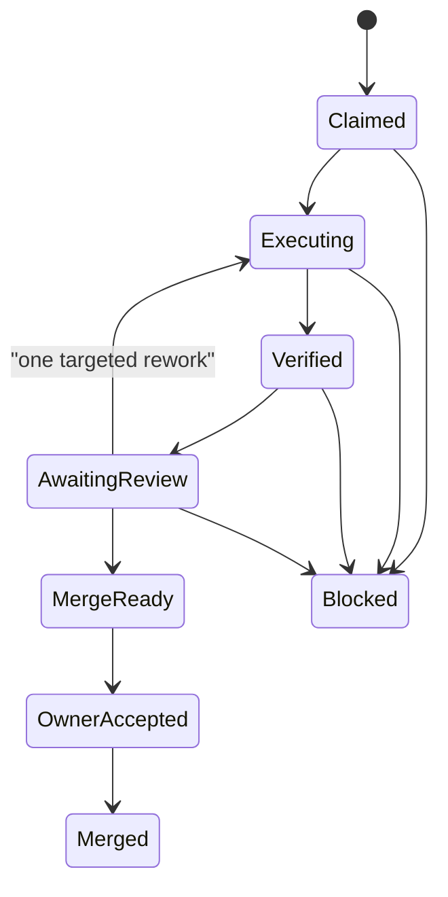

# Maestro Master Plan

## 1. Charter

Maestro is a standalone, project-neutral development-operations system. It is not a product feature of Foundry, Vennue, or any other individual repository.

Its job is to make AI-assisted engineering work visible, structured, recoverable, and governed. It turns one owner-approved milestone into a controlled result with explicit task ownership, evidence, independent review, and an owner acceptance point.

Maestro does not replace a project's architecture, product decisions, or engineering rules. A project joins Maestro through an adapter and declares its own repository, environments, commands, exceptions, and authority policy.

## 2. Operating principles

1. Project plans and code remain versioned in their own repositories.
2. Maestro keeps durable operational memory: what it observed, what is running, what is blocked, what evidence exists, and which action is safe next.
3. There must never be two independently writable truths for the same fact.
4. A known wait is shown immediately: who is running, when it began, what result is awaited, its timeout, and the next permitted action.
5. A worker may not silently redesign a plan. Missing information becomes a tracked question or proposal.
6. Conversation is valid planning input, but never the only record. Every source item must be captured and traced.
7. Local models do bounded, well-specified work. Cloud models do planning, contracts, integration, high-judgment work, and independent review.
8. Maestro begins Linux-first on the AI box. Windows is used only where a target or tool genuinely requires it.

## 3. System shape

### Responsibilities

| Component | Responsibility |
|---|---|
| Project repository / GitHub | Product and engineering records, code, PRs, reviews, CI, approved plan artifacts |
| Maestro coordinator | State transitions, locks, dispatch, recovery, evidence collection, notifications, gate enforcement |
| Operational database | Runs, tasks, packets, attempts, events, evidence, waits, retries, notifications, projected GitHub facts |
| Local Atlas | Read-only operational reporting for the AI box; clear task subjects, routing, status, evidence, and blockers |
| Project adapter | Project-specific branch policy, commands, environments, credentials references, records, and exceptions |
| Murphy adapter | Manual, owner-approved remote QA against deployed Azure environments |

## 4. Durable state model

Every run and packet has durable state. The initial milestone lifecycle is:

Transitions are idempotent. After restart, duplicate poll, stale completion, or timeout, Maestro rereads the authoritative repository and database facts, then performs only the next safe action exactly once.

## 5. Planning and traceability model

Before implementation, each project passes a Project Foundation stage defining purpose, non-goals, architecture boundaries, environments, release policy, quality baseline, roles, security constraints, and the decision boundary between design and implementation.

Every feature then uses the same constrained records:

| Record | Required contents |
|---|---|
| Feature brief | Outcome, non-goals, users, acceptance, owner, approval |
| Question | ID, exact question, owner, status, resolution/evidence |
| Decision | Context, options, choice, reason, consequences |
| Milestone | Plain subject, outcome, exit condition, dependencies, risks |
| Packet / task | Plain subject, outcome, owned paths, interfaces, invariants, behavior paths, checks, executor route, reviewer route |
| Coverage | Every required path mapped to a check or `UNTESTED` with a reason |

The planning intake process is mandatory:

1. Register every supplied document, archive, existing record, issue, and planning-session capture.
2. Extract atomic requirements, decisions, constraints, questions, task candidates, and deferrals.
3. Produce checkpoint deltas during planning: recorded decisions, new requirements, changed tasks, open questions, deferrals, and source coverage.
4. Run an independent completeness audit before the plan is ready.
5. Require every source item to link to a requirement, decision, task, question, explicit deferral, or not-applicable record.

## 6. Task presentation and routing

Every task has a plain action-oriented title suitable for an owner to scan, for example: `M1-02 · Establish control base and default skin`.

Its supporting record must already state:

- planned execution location: local, cloud, or remote environment;
- agent role: coordinator, planning, implementation, specification, reviewer, or QA;
- intended model/class;
- independent reviewer route;
- owned paths, acceptance behavior, invariants, and validation commands.

When work begins, Maestro records the factual run instance, model/runtime, timestamps, evidence, retries, and outcome. This does not delay routing; it preserves an honest audit trail if the assigned route changes.

## 7. Worker wrapper

A local-worker packet follows the same controlled loop:

1. Author a bounded packet.
2. Compile its allowed paths, permission configuration, and machine-checkable invariants.
3. Dispatch in a fresh worktree after preflight and context checks.
4. Grade scope, commit, build, types, and packet invariants mechanically.
5. On one failure, send only the failing check as targeted rework.
6. Escalate after a second failure.
7. Record the packet, run, failure, evidence, and reusable invariant.

Packet enforcement should include path locks, a real-commit check, timeout policy, minimum context gate, per-run model fingerprint, session archive, and serialized resource use against verification gates.

## 8. Murphy integration

Murphy is not a local coding worker. It is a remote QA capability that tests deployed Azure environments.

Its project policy is currently manual / owner-approved. A Murphy run receives the target environment, deployed version or commit, and scoped QA credentials; it produces a report, linked issues where appropriate, and a structured run result stored by Maestro. M0 does not contact Azure or alter that policy.

## 9. Phased roadmap

### M0 — foundation and consolidation

- Create the private Maestro repository and controlled records.
- Capture and trace all source material.
- Define the project-neutral process, planning schema, bootstrap/register contract, and architecture.
- Assess Atlas for migration into local operational reporting.
- Independently audit completeness and obtain owner acceptance.

### V1 — prove one control loop

- Register one project.
- Persist one run in the operational database.
- Show the run in local Atlas.
- Coordinate one bounded worker through a draft PR, verification, and review.
- Stop for owner acceptance and merge.

### V2 — controlled delegation

- Enforce work-packet ownership and routing.
- Dispatch suitable bounded tasks to local models.
- Add formal role definitions and routing configuration.

### V3 — mature automation support

- Independent review policy with owner escalation cap.
- QA hooks, process metrics, and retrospective records.
- Linux-native disposable-container verification when individual project adapters require it.

## 10. Open decisions

1. Initial database shape and precise SQLite backup/recovery procedure.
2. Local Atlas UI technology and database access boundary.
3. Notification channel and acknowledgement model.
4. Review-round cap and escalation policy.
5. Project-manifest format and versioning policy for the shared process.
6. Exact migration boundary between current Atlas records and Maestro's operational projection.
7. Credential-storage and permission model for repository, worker, and Murphy adapters.

## 11. M0 acceptance

M0 is complete only when the source inventory has full traceability, this plan reflects every accepted item or an explicit deferral, the Atlas transition is assessed, the open-decision register is visible, and an independent planning audit has been reviewed by the owner.
