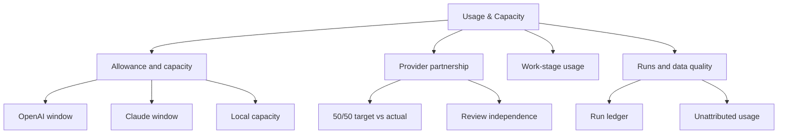
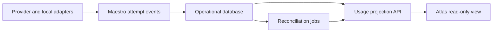

# Proposed Feature — Agent Usage Observability

- **Status:** Comprehensive feature proposal captured for reconciliation; not
  approved as one implementation scope
- **Implementation authority:** None
- **Approval authority:** Owner
- **Original discussion date:** 2026-08-30
- **Captured branch/head:** `docs/agent-usage-observability` at `bb4a35a`

## 2026-08-31 reconciliation

The Owner has now approved bringing the early OpenAI/ChatGPT allowance-window,
context-budget, token/cost measurement, patient worker-status, and Atlas-ready
reporting subset into the Alpha-04 synthetic qualification plan. That bounded
subset is carried by
[M0-D14](../decisions/m0-d14-context-and-token-reporting.md) and its pending
planning amendment.

The broader items below—including a 50/50 Claude partnership denominator,
CLI-first policy, live provider adapters, exact telemetry sources, Atlas UI,
retention, warning thresholds, and any budget-enforcement authority—remain
proposed and unresolved. Capturing this document does not approve those items,
release an execution packet, or authorize provider access.

> **Proposal boundary:** M0-D14 separately bounds the early allowance,
> context, token, checkpoint, and read-only reporting subset. Everything else
> below remains a possible future feature and requires its own decisions,
> review, and release.
> The owner-provided 50/50 Claude Code partnership is a design input for this
> proposal, not a currently active allocation rule.

## 1. Proposal summary

Consider adding provider-neutral agent usage observability to Maestro so the
owner can understand where limited hosted-agent allowances and local compute are
being consumed across architecture, coordination, implementation, review,
correction, integration, QA, and child-agent work.

The proposal should reuse Maestro's planned operational model rather than create
a parallel tracker:

- the work graph and packets describe what was intended;
- dispatch decisions describe why a provider/model was selected;
- attempts and leases describe what actually ran and which resources it held;
- evidence describes what the attempt produced and whether it passed;
- review units describe independent review and correction rounds; and
- Atlas presents a read-only projection for owner decisions.

A related candidate practice is to conduct substantial repository-related
architecture conversations in Codex CLI when practical because local Codex
surfaces can expose structured token measurements and associate the conversation
with repository context. ChatGPT Work/web would remain available when owner
interaction, visual work, connected apps, or mobile access provides material
value.

Neither the observability feature nor the CLI-first practice is approved by this
record.

## 2. Owner design input: Claude Code as a 50% partner

Claude Code is intended to be a 50% hosted-agent partner alongside OpenAI
Codex/ChatGPT for eligible Maestro work. For this proposal, Claude Code must
therefore be modeled as a first-class execution provider, not as an exception,
fallback, role, reviewer title, or replacement for Maestro.

This design input has four consequences:

1. Atlas must show the partnership target and the observed provider mix.
2. Maestro must capture equivalent operational evidence from OpenAI and
   Anthropic adapters wherever each provider exposes it.
3. Provider identity must remain separate from role, work category, execution
   location, and review authority.
4. A variance from 50/50 must remain explainable rather than silently forcing a
   provider onto work it cannot safely or effectively perform.

The denominator and time window for “50%” are not yet approved. The recommended
headline measure is each provider's share of **accepted, eligible hosted work
attempts** during the selected window. Atlas should also show wall time,
provider-native usage, and estimated cost as separate comparisons. It must not
pretend that a token from one provider is directly equivalent to a token from
another.

Local-agent work is displayed alongside the partnership but excluded from the
OpenAI-versus-Claude denominator. The screen should make that exclusion
explicit.

## 3. Fit with Maestro's planned design

| Existing Maestro concept | Proposed observability use | Authority preserved |
| --- | --- | --- |
| Project binding and process version | Attribute usage to the correct project and active process contract | Repository/GitHub remains engineering authority |
| Work graph node and packet | Carry planned role, provider/model class, location, reviewer, paths, acceptance behavior, and invariants | No packet or graph rule is changed |
| Dispatch decision | Record selected provider/model and the factual route reason | Routing remains governed by approved policy |
| Attempt and lease | Record actual provider/model, start/end, host, resource reservations, retries, and outcome | Maestro remains operational memory |
| Evidence bundle | Attach token facts, commands, tests, commit, changed paths, and gate results | Evidence does not replace acceptance |
| Integration batch and review unit | Attribute review rounds, corrections, reviewer provider, and independence | Existing review scope and merge authority remain unchanged |
| Coordinator event audit | Explain reroutes, stalls, timeouts, cancellations, and unattributed use | No new control action is granted |
| Atlas projection | Present usage, capacity, pace, and data quality | Atlas remains read-only |

The proposal assumes Atlas reads a Maestro-owned projection through the planned
local API. Atlas must not query operational tables directly, scrape provider
interfaces, or become a controller.

## 4. Problem to investigate

Hosted work, architecture conversations, implementation, review, and child
agents can draw from limited account allowances. Local agents consume scarce
hardware and coordinator time even when they do not create a provider invoice.
Without a joined operational record, the owner cannot reliably answer:

- how much usage went to architecture/planning versus implementation;
- whether OpenAI and Claude Code are participating near the intended partnership;
- how much was consumed by initial review, correction, or renewed review;
- whether child agents, high reasoning, fast service tiers, long context, or
  failed attempts caused unusual consumption;
- whether a local worker was productive or merely occupied the GPU;
- which model and execution environment actually performed each job;
- how much coordinator rework followed a local or hosted attempt;
- whether independent review used a different provider where intended; or
- how much provider-account usage remains unattributed to a controlled run.

OpenAI exposes structured token facts for controlled Codex runs, but a personal
ChatGPT account does not currently expose a supported API that gives Maestro
exact usage for every web conversation. Anthropic and local runtimes may expose
different levels of telemetry. The design must preserve those differences
honestly.

## 5. Candidate operating practice

If later approved, substantial repository-related architecture and planning
conversations would default to Codex CLI when practical.

Potential exceptions include:

- quick owner questions or decisions;
- visual design and rendered artifacts;
- connected-app work unavailable in the CLI;
- mobile access; and
- another surface that provides a documented material advantage.

A web conversation would still be registered under its honest work category.
The system would not repeat an entire conversation on a second surface merely to
manufacture telemetry. Accepted outcomes would still be preserved in versioned
planning records under the existing authority model.

Whether this practice should be mandatory, recommended, or omitted remains an
owner decision.

## 6. Provider-neutral measurement model

### 6.1 Identity dimensions

Every record must keep these dimensions separate:

| Dimension | Examples |
| --- | --- |
| Role | Architecture, Theme Studio, Display Runtime, Integration, QA, Reviewer |
| Work category | Planning, implementation, decision review, implementation review, correction |
| Execution provider | OpenAI, Anthropic, local runtime |
| Agent surface | Codex CLI, ChatGPT Work, Claude Code, local executor adapter |
| Model | Exact provider model ID or local model fingerprint |
| Location | Hosted, developer workstation, Linux AI box, QA environment |
| Authority | Executor, reviewer, coordinator, owner |
| Route reason | Capability, quality requirement, independence, availability, cost, capacity |

“Claude Code,” “Codex,” and a local runtime are execution surfaces/providers.
They must never substitute for the role or authority fields.

### 6.2 Candidate run record

A future design could assign every controlled agent or architecture run a stable
Maestro job ID and capture:

- project, workstream, graph node or packet, role, work category, and parent job;
- planned provider/model class and planned execution location;
- factual provider, surface, model ID, runtime version, and execution location;
- account or local-host identifier without storing credentials;
- provider session/run identifier, attempt number, start/end time, and outcome;
- reasoning level, speed/service tier, authentication/billing mode, and route
  reason;
- input, cached-input, output, and separately reported reasoning-token detail;
- provider-native credits or account units with rate-card version and effective
  date;
- local queue time, load time, inference time, throughput, and resource
  reservation when available;
- retries, stalls, corrections, targeted follow-ups, renewed full reviews, and
  first-pass acceptance;
- reviewer role, reviewer provider/model, review round, findings, and gate result;
- branch, commit, changed paths, commands, tests, artifact links, and evidence
  references; and
- measurement quality: `measured`, `estimated`, `account-delta-only`, or
  `unavailable`.

Prompt, source, chain-of-thought, credentials, secrets, and full tool traces would
not be copied into usage telemetry. The record stores operational facts and
references to already-authorized evidence.

### 6.3 Work categories

1. architecture and planning;
2. coordination and packet preparation;
3. implementation;
4. Independent Decision Fidelity Review;
5. Independent Implementation Review;
6. correction and targeted follow-up review;
7. integration;
8. QA; and
9. general or unattributed assistant usage.

The category belongs to the work, not the provider. An architecture run in
Claude Code and an implementation run in Codex remain distinguishable.

### 6.4 Measurement quality

Every number shown in Atlas must carry source and freshness:

- **Measured:** emitted by the provider/runtime for this exact attempt.
- **Estimated:** calculated from measured inputs and a versioned rate card.
- **Account-delta-only:** observed at an account window, not attributable to one
  attempt.
- **Unavailable:** provider/runtime did not expose the fact.

Estimated values must not be styled as measured values. Missing data is a state,
not zero.

## 7. Candidate capture sources

| Execution class | Candidate source | Expected facts | Known limitation |
| --- | --- | --- | --- |
| Codex CLI controlled run | Structured JSON and OpenTelemetry | Run IDs, token counts, timing, model/runtime, child-run relationships | Coverage depends on client and configuration |
| ChatGPT Work/web | Supported usage surfaces and explicit job registration | Allowance/window observations, work category, elapsed time | Exact per-conversation usage may be unavailable |
| Claude Code | Versioned Anthropic/Claude adapter using supported local or account telemetry | Session/attempt ID, model, elapsed, provider-native usage, tools/outcome where exposed | Exact account allowance and token detail depend on plan and supported surface |
| Local agent runtime | Executor events plus runtime and host telemetry | Model fingerprint, timing, tokens/throughput, queue, resource locks, outcome, evidence | Different runtimes expose different fields |
| Review and integration | Maestro review unit and evidence records | Reviewer/provider independence, rounds, findings, correction use, gate result | Requires stable attempt/review linkage |
| Provider account window | Supported account or billing observation | Remaining/used amount, reset time, precision | May be coarse or delayed |

The proposal does not endorse unsupported UI scraping, invented token counts, or
repurposing API credentials. Any future adapter must be versioned and preserve
the raw provider observation and its timestamp.

Current OpenAI reference points:

- [Codex non-interactive JSON output](https://learn.chatgpt.com/docs/non-interactive-mode)
- [Codex observability](https://learn.chatgpt.com/docs/config-file/config-advanced)
- [Codex usage commands](https://learn.chatgpt.com/docs/developer-commands)
- [ChatGPT Work/Codex pricing and usage](https://learn.chatgpt.com/docs/pricing)

Provider contracts and rates can change. An approved implementation would need
versioned adapters and a recorded rate-card source/version for every provider.

## 8. Local-agent tracking

A local agent is not “free” for observability purposes. It consumes queue
capacity, GPU/CPU/RAM, wall time, reviewer attention, and sometimes substantial
coordinator correction. Maestro should track the full attempt lifecycle.

### 8.1 Local attempt facts

- stable job, packet, parent, and attempt IDs;
- local executor adapter and runtime version;
- model family, exact model/digest, quantization, context configuration, and
  sampling/reasoning settings;
- host ID, device class, GPU/CPU/RAM reservation, and serialized-resource locks;
- queue-entered, lease-acquired, model-load, generation-started, completed, and
  evidence-retrieved timestamps;
- prompt/input tokens, cached tokens, output tokens, context use, and tokens per
  second when the runtime exposes them;
- timeout, stall, retry, cancellation, or coordinator-intervention reason;
- branch/commit, changed paths, commands, tests, artifacts, and gate result;
- first-pass acceptance, correction count, review findings, and final disposition;
- reviewer provider/model and whether the review was provider-independent; and
- optional retained-contribution and coordinator-rework indicators, clearly
  labeled as derived measures.

Until capacity evidence justifies a different policy, the screen should reflect
the existing serialized-resource behavior rather than implying that parallel
heavy inference is available. This proposal does not change that behavior.

### 8.2 Local capacity states

Atlas should distinguish:

- **Queued:** waiting for an eligible local host or resource lock.
- **Loading:** runtime accepted the job and is loading the model/context.
- **Running:** generation or tool execution is active.
- **Evidence:** execution ended and Maestro is retrieving/verifying evidence.
- **Review:** attempt is complete but not yet accepted.
- **Accepted:** evidence and required gates passed.
- **Failed:** attempt ended unsuccessfully.
- **Stalled:** heartbeat or progress exceeded a defined threshold.
- **Cancelled:** ended by an already-authorized control action.

A live local card should answer: who owns the lease, what model is loaded, what
packet is running, how long it has run, what resource is blocked, when progress
was last observed, and what the next permitted action is. Atlas would display
these facts but would not provide start, pause, retry, cancel, or reassign
controls.

### 8.3 Local value view

Local effectiveness should not be reduced to raw token volume. Candidate
measures include:

- accepted local attempts and first-pass acceptance;
- elapsed time and queue wait per accepted attempt;
- review findings and correction rounds;
- coordinator intervention and rework;
- retained implementation contribution where it can be measured reliably;
- QA escapes associated with accepted local work; and
- hosted-review usage required to accept the local result.

Dollar cost should be displayed only when the owner later approves a defensible
local-compute cost model. Otherwise Atlas should say “local compute” and show
capacity/time facts separately from hosted spend.

## 9. Proposed Atlas information architecture

### 9.1 Surface and navigation

Add a candidate read-only **Usage & Capacity** surface within Atlas. It should
use the same stable IDs, concise task subjects, planned execution location,
agent/model identity, reviewer identity, and owner-facing vocabulary as the
rest of Atlas.

The surface should support:

- event-driven updates from Maestro's local API;
- a consistent snapshot fallback after disconnect/reconnect;
- an explicit “last updated” time and source freshness;
- filters for time window, project, workstream, role, provider, model, location,
  outcome, and measurement quality; and
- links from usage rows to the existing work, decision, review, and evidence
  projections without copying their authority.

### 9.2 Screen hierarchy

The page should follow an operational scan order: current constraint, provider
balance, where usage went, what is running, then detailed evidence.

| Screen region | What appears | Owner question answered |
| --- | --- | --- |
| Summary cards | OpenAI remaining/pace/reset, Claude used/remaining/reset where supported, local GPU/host state, unattributed warning | “What is constrained right now?” |
| Partnership band | 50/50 target, actual OpenAI/Claude share, metric/window, local contribution shown separately, reason for variance | “Are both hosted partners participating as intended?” |
| Work-stage view | Usage by architecture, coordination, implementation, reviews, corrections, integration, and QA | “Where is the allowance going?” |
| Active runs | Hosted and local attempts, lease owner, elapsed, last progress, resource, expected evidence | “What is consuming capacity now?” |
| Review economics | Initial review, targeted follow-up, renewed full review, correction use, provider independence | “How much is review and rework costing?” |
| Run ledger | Dense, filterable attempt history with expandable evidence | “Which exact job caused this usage?” |
| Data quality | Measured/estimated/unavailable share, stale sources, reconciliation remainder | “How much can I trust?” |

### 9.3 Summary cards

The cards must not imply false equivalence between providers.

**OpenAI card**

- current supported allowance/credit window;
- used and remaining observation;
- reset time;
- pace versus elapsed window;
- active model/service tier facts; and
- measurement confidence and last refresh.

**Claude card**

- current supported plan/account observation;
- used and remaining facts where exposed;
- reset time if known;
- active Claude Code sessions and model IDs;
- pace using the provider's native unit; and
- measurement confidence and last refresh.

**Local capacity card**

- eligible/busy/offline hosts;
- active model fingerprint;
- GPU or serialized-resource lease;
- local queue depth and oldest wait;
- elapsed time and last progress; and
- recent accepted/failed/stalled attempts.

**Unattributed card**

- account delta not linked to controlled jobs;
- provider and allowance window;
- precision of the observation;
- possible overlap from concurrent work; and
- warning severity based on an owner-approved threshold.

### 9.4 Provider partnership band

The partnership presentation should use a horizontal comparison with a visible
50% target marker, not a provider-brand contest.

- Default metric recommendation: accepted eligible hosted attempts.
- Alternate views: hosted wall time, native usage, and estimated cost.
- Window choices: current allowance window, trailing 7/30 days, and selected
  project period.
- Local work: a separate contribution band, never folded into either provider.
- Variance label: capability requirement, reviewer independence, provider
  availability, owner route, missing telemetry, or other recorded dispatch
  reason.
- No status color should be assigned merely because one provider is above 50%.
  Warning treatment is reserved for unexplained variance, stale data, or an
  owner-approved threshold.

The selected metric and eligibility rule must be printed beside the percentage.
A standalone “OpenAI 62% / Claude 38%” without its denominator is insufficient.

### 9.5 Work-stage presentation

Use a stacked bar or compact table by work category, with provider and location
drill-down. Architecture conversations must appear as a real category, including
registered ChatGPT Work sessions whose exact token count is unavailable.

Each stage should show:

- controlled attempt count;
- measured provider-native usage;
- estimated cost where approved;
- local wall time;
- accepted, failed, stalled, and corrected outcomes;
- child-agent share; and
- measured/estimated/unavailable coverage.

### 9.6 Run ledger

Recommended visible columns:

| Time | Work | Role | Provider/model | Location | Elapsed | Usage | Outcome/gate | Review | Quality |
| --- | --- | --- | --- | --- | --- | --- | --- | --- | --- |
| Start or end | Project, packet, concise subject | Factual role | Provider badge and exact model | Hosted/local/QA | Queue + run | Native measured/estimated value | Running, accepted, failed, stalled | Reviewer provider and round | Measurement quality/freshness |

Expanding a row should reveal:

- parent/child attempt chain;
- planned versus factual route;
- dispatch reason and process version;
- provider session/run identifiers;
- token/account/runtime facts with source timestamps;
- resource leases and lock history;
- commands, tests, commit, changed paths, and artifacts;
- review findings and correction relationships;
- reconciliation membership; and
- links to authoritative work/evidence projections.

The detail view must not expose prompts, hidden reasoning, secrets, credentials,
or unrestricted raw traces.

### 9.7 Review and correction presentation

The screen should separate:

- initial independent review;
- correction work;
- targeted follow-up review;
- renewed full review; and
- QA after acceptance.

For each review unit, Atlas should show author provider, reviewer provider,
independence status, rounds, findings, elapsed time, provider-native usage, and
gate result. Cross-provider review coverage can be reported, but this proposal
does not create or weaken any reviewer-independence rule.

### 9.8 Required states

The candidate UI must be designed for:

- no observations yet;
- one provider connected and another unavailable;
- supported account summary without per-run detail;
- per-run detail without a supported account allowance summary;
- stale provider observation or unknown reset time;
- concurrent work producing an unattributed remainder;
- a local job queued, loading, running, retrieving evidence, or stalled;
- a provider adapter error;
- model/rate-card version changing inside the selected window;
- child agents still running after the parent surface completes; and
- allowance pace above an owner-approved warning threshold.

On narrow screens, summary cards and active constraints should appear first,
followed by a vertical run list. Detailed charts and evidence expand on demand.
Provider identity should use text labels/badges; status color is reserved for
capacity, pace, gate, and data-quality meaning. All states require accessible
contrast and a non-color cue.

## 10. Candidate reconciliation

Each provider/account/allowance window must have its own ledger:

`tracked controlled usage + registered coarse usage + unattributed remainder = observed provider-account change`

If a provider reports only a remaining percentage or another coarse value,
Maestro preserves the raw observation, source, timestamp, and precision.
Concurrent work that cannot be separated remains visibly unattributed.

Cross-provider summary rules:

- never add OpenAI tokens to Anthropic tokens and label the result “total
  tokens”;
- show provider-native units side by side;
- use monetary estimates only with a versioned rate card and compatible billing
  basis;
- show local compute time/capacity separately unless a local-cost policy is
  later approved;
- select one explicit denominator for the 50/50 headline; and
- retain the dispatch reason for any partnership variance.

Parent/child usage must roll up without double counting. The root job should show
its inclusive child usage while the ledger keeps each attempt as a separate
factual record.

## 11. Candidate data flow

Adapters normalize common operational fields while preserving provider-specific
raw facts and their source/time. A provider adapter must not be allowed to write graph,
packet, decision, acceptance, or merge truth.

## 12. Validation approach if later approved

A bounded validation could be considered before any routing or budget feature:

1. record controlled OpenAI, Claude Code, and local attempts in shadow mode;
2. verify parent/child rollups and no-double-counting behavior;
3. compare attempt records with supported provider-account observations;
4. exercise local queue, lease, model fingerprint, stall, and evidence states;
5. test the 50/50 view with missing data and an explained routing variance;
6. confirm Atlas remains read-only and reveals no sensitive prompt/credential
   content; and
7. ask the owner whether the screen answers “where did the allowance and local
   capacity go?” without requiring raw-log inspection.

This validation sequence is part of the proposal only. It is not a packet,
roadmap assignment, implementation approval, or change to the current handoff.

## 13. Decisions required before approval

1. Approve, revise, defer, or reject the feature.
2. Decide whether CLI-first architecture work is mandatory, recommended, or not
   part of the feature.
3. Define the eligible work, denominator, and time window for Claude Code's 50%
   hosted partnership.
4. Define which Anthropic/Claude Code telemetry sources are supported and
   permitted for the owner's account.
5. Define which OpenAI execution surfaces must provide exact telemetry and which
   may remain estimated/unattributed.
6. Define the local executor/runtime contract, minimum model fingerprint, host
   metrics, heartbeat, and resource-lock facts.
7. Decide the Atlas navigation location, default filters, pace warnings, and
   partnership-variance presentation.
8. Define rate-card versioning and per-provider account-window reconciliation.
9. Define telemetry retention, privacy, redaction, and Atlas access.
10. Define whether usage can only inform recommendations or may enforce future
    owner-approved budgets.
11. Choose an eligible delivery stage without changing the current authorized
    Alpha work.
12. Provide the complete M0-D12 bounded quality contract before any
    implementation packet is dispatched.

## 14. Explicit non-authorizations

This proposal does not authorize:

- implementation, database schema changes, telemetry configuration, adapters, or
  Atlas UI;
- modifying any existing rule, role, route, handoff, roadmap, control-plane
  record, planning decision, or Alpha record;
- enforcing a 50/50 provider quota or automatically assigning work to Claude
  Code or OpenAI;
- treating Claude Code, Codex, ChatGPT, or a local runtime as a role or authority;
- changing reviewer independence, review scope, owner acceptance, merge
  authority, or model-quality requirements;
- changing the current Architecture Agent job role or required work surface;
- moving an active conversation or duplicating work for measurement;
- obtaining new API keys, changing account authentication, starting a
  subscription, purchasing credits, or creating provider spend;
- automatic model rerouting, budget enforcement, or degraded-quality fallback;
- unsupported scraping of provider account data;
- changing serialized local-resource behavior;
- exposing prompts, hidden reasoning, credentials, secrets, or unrestricted raw
  traces;
- changing Alpha-01/Alpha-01-R1 or its exact next gate; or
- merge, deployment, or successor work.
