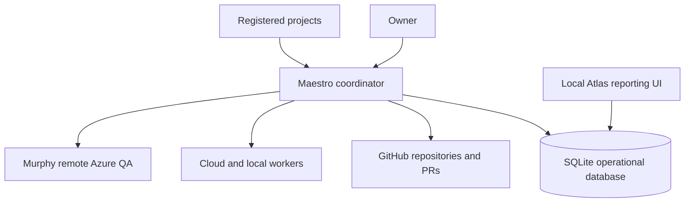
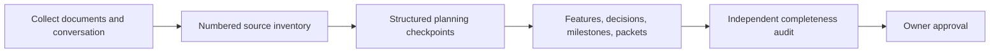
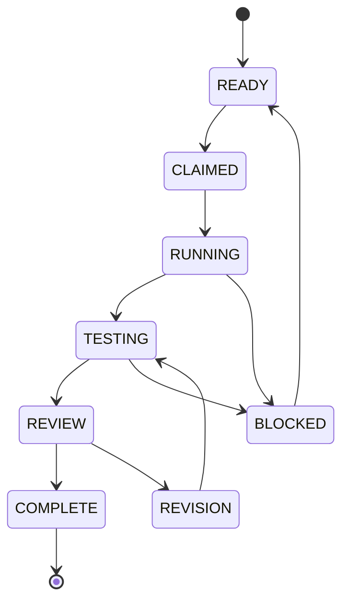
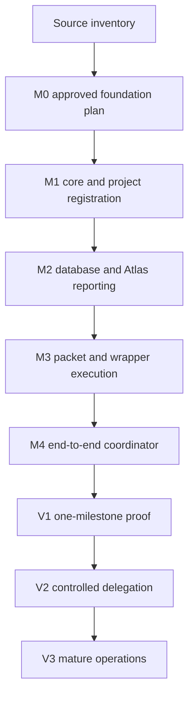

# Maestro Alpha 1 — Planning Capture, Action Report, and Handoff

**Status:** Planning capture — not approved for implementation  
**Repository:** `jmiedreich-ux/Maestro`  
**Current branch:** `master`  
**Last updated:** 2026-08-27

## Purpose

This report turns the Alpha 1 planning conversation into durable, actionable planning material. It combines:

1. `sources/planning/maestro-alpha-1-session.txt`
2. `sources/planning/local-agent-notes.md`
3. VennueSign's proposed Maestro design: `docs/design/proposed/maestro-dev-lead-agent-framework.md`
4. The existing Atlas repository: `jmiedreich-ux/Atlas`
5. `sources/planning/maestro-alpha-1-source-inventory.md`

This is a capture and handoff document. It is not permission to build the coordinator yet.

## Plain-language outcome

Maestro becomes the project-neutral development-operations system for the AI box.

It will eventually provide:

- A durable coordinator for milestones, packets, workers, reviews, verification, and recovery.
- A SQLite operational database for one-box operation.
- Atlas as the local reporting interface reading Maestro's database.
- Project registration and bootstrap for VennueSign, Foundry, and future projects.
- Cloud-to-local task routing with the planned executor and reviewer visible before work starts.
- Murphy as a separate remote Azure QA capability.
- Consistent planning records so important requirements and decisions from conversations cannot disappear.

## Target architecture

The AI box hosts Maestro, SQLite, the local Atlas reporting UI, local models, worktrees, build tools, and verification tools. No public dashboard or inbound internet endpoint is required for the initial system.

## Authority boundaries

| Area | Authority |
|---|---|
| Product requirements and design decisions | Owner-approved project records |
| Source code, branches, PRs, reviews, and CI | GitHub/project repository |
| Execution state, leases, attempts, evidence, timings, retries, and notifications | Maestro database |
| Reporting view | Atlas projection of Maestro database data |
| Azure deployed-environment QA | Murphy, under project policy |
| Final acceptance, merge, and deployment | Owner |

The database must not become a second unrelated source of truth for product requirements. Maestro synchronizes repository/GitHub facts into operational state; Atlas reads the operational state.

## Operational data model

SQLite is the initial durable execution store. The first schema must cover:

| Record | Purpose |
|---|---|
| Projects | Repository identity, checkout, profile, process version, policies, and adapter configuration |
| Milestone runs | Approved milestone, branch, PR, current state, owner gate, lease, and recovery position |
| Packets | Dependencies, allowed paths, assigned route, reviewer, status, acceptance contract, and time budget |
| Attempts | Exact agent/model/runtime, external response ID, start/end, result, infrastructure outcome, and retry count |
| Evidence | Commands, verbatim output, commit SHA, changed files, diff, model digest, resource samples, and review outcome |
| Events | Poll, webhook, worker completion, CI, review, merge, timeout, reboot, and recovery observations |
| Notifications | Destination, message type, sent time, delivery/acknowledgment, and related waiting state |
| Questions and gates | Blocking question, required approver, decision link, and release condition |

SQLite remains local while Maestro uses one AI box and one coordinator. A future Postgres migration is allowed only when distributed runners, concurrent coordinators, or a remote dashboard create a real need.

## Planning rules to preserve

Every planning input must be classified as one of:

- Requirement
- Decision
- Constraint or non-goal
- Open question
- Task candidate
- Deferred item

Every item must trace to a durable record. Nothing may disappear into a prose summary.

Every feature and milestone must use consistent structured records:

| Record | Required content |
|---|---|
| Feature brief | Outcome, users, non-goals, acceptance, owner, approval |
| Question | ID, exact question, owner, status, resolution/evidence |
| Decision | Context, options, choice, reason, consequences |
| Milestone | Outcome, exit condition, dependencies, risks |
| Task/packet | Plain subject, outcome, owner, allowed paths, interfaces, invariants, commands, reviewer, route |
| Coverage | Every required behavior mapped to a check or explicit `UNTESTED` reason |

Task titles must be short and plainly worded. Supporting explanation belongs in the task body.

Every roadmap task must show its planned route before execution:

- Execution location: local, cloud, or remote environment.
- Agent type: coordinator, implementation, specification, reviewer, QA, or other defined role.
- Model class or selected model.
- Independent reviewer.
- Validation commands.
- Dependencies and risk.

Planned routing and actual run facts are separate. Actual facts are recorded automatically when work begins; the user should never have to wait to learn the intended assignment.

## Planning-session capture process

At natural checkpoints, Maestro must record:

- Recorded decisions
- New requirements
- Changed milestones or tasks
- Open questions
- Explicit deferrals
- Source coverage
- Conflicts or items needing owner confirmation

Before implementation begins, an independent planning auditor compares every source item with the actual plan. Each source item must point to a requirement, decision, task, question, or explicit deferral.

## Project creation and registration

Maestro provides two different flows:

- `maestro project create` establishes a new project using Maestro's shared process.
- `maestro project register` inventories an existing project and binds its existing rules without overwriting them.

The create flow must:

1. Register repository identity, default branch, local checkout, and GitHub installation.
2. Create the project and initial ledger records in SQLite.
3. Select a profile such as library, web application, API, or deployed Azure application.
4. Record process version, project exceptions, required checks, environments, secret references, branch rules, and approval/merge policy.
5. Generate the thin project manifest, process binding, planning templates, issue/PR templates, and Atlas project view.
6. Open one bootstrap PR containing only repository-facing files; Maestro's machine-local configuration stays in Maestro.
7. Run a dry-run proving it can read the repository, create a branch and PR, execute one declared check, persist the result, and display it in Atlas.

Every project then passes a Project Foundation gate before feature work. The foundation records purpose, non-goals, users, architecture and technology boundaries, environments, deployment model, release policy, quality baseline, roles, ownership boundaries, security/external-service rules, and which choices require design approval.

## Development execution lifecycle

One run handles one owner-approved milestone. It creates one controlled draft PR, completes its review and verification gates, prepares the acceptance record, and stops. Automatic progression across multiple milestones is not part of the initial boundary.

Local workers receive suitable bounded work. Cloud coordination remains responsible for planning, architecture, contracts, integration, high-judgment work, and independent review. Local workers do not redesign requirements, approve their own work, merge, deploy, or make product decisions.

## Task routing

Initial routing is configuration, not a permanent model decision.

| Work | Default route |
|---|---|
| Mechanical documentation, indexing, scaffolding, focused tests | Local fast worker |
| Bounded multi-file implementation and difficult contained defects | Local developer worker |
| Contracts, migrations, cross-cutting integration, unresolved ambiguity | Cloud |
| Planning, architecture, security, identity, final review | Cloud |
| Deployed Azure environment QA | Murphy, remote Azure |
| Independent review | Different model/vendor from author when practical |

The current evidence says Qwen 3.6 27B is the proven local implementation model from the six-packet run. The VennueSign design names `qwen3-coder:30b`, `gpt-oss:20b`, and `qwen3.5:9b-q4_K_M`. Before implementation, resolve whether these are model-tag differences, test-era differences, or a stale routing table.

Only one local inference job runs at a time until capacity evidence supports concurrency.

## Worker enforcement wrapper

The local model must not be trusted to self-report that a packet is complete. Maestro needs an enforcement wrapper around every local execution. The wrapper runs the worker, then mechanically checks the result against the packet contract:

- **Scope:** `git diff --name-only` contains only allowed paths.
- **Build:** run `npm run build` and `npm exec tsc -- --noEmit` where applicable. The type-check closes the gap where an unintegrated file can avoid the normal build.
- **Commit:** verify that a real commit exists; do not trust the model's completion message.
- **Invariants:** run packet-specific checks such as required providers being rendered, no duplicate `#root`, valid markup, and required focus styles.
- **Evidence:** retain commands, outputs, changed files, commit SHA, model/runtime fingerprint, and disposition.

The wrapper allows one bounded rework cycle. On failure, it sends the worker the exact failed check. If the second attempt fails, Maestro escalates to cloud review or takeover. It does not start an endless repair loop.

Planned helper capabilities are:

- Preflight ping before spending a real attempt.
- Permission lock restricting writes to allowed paths.
- Runaway timeout and safe termination.
- Automatic performance-ledger entry.
- Model/context/quant fingerprinting.
- Fake-completion detection from the agent event stream.
- Packet linter that checks prompts for explicit paths, prohibitions, and existing-context references.
- Fresh worktree per attempt.
- Context-length hard gate.
- Unattended execution lock with closed stdin.
- Session export beside the evidence record.

The wrapper enforces format, scope, and repeatable checks. It cannot replace cloud judgment about architecture or whether the requirement itself is correct.

## Durable coordinator requirements

The coordinator must not depend on an open chat turn.

It needs:

- Durable task and milestone state.
- Explicit leases and locks.
- Idempotent transitions.
- Reboot and crash recovery.
- Known waiting state, awaited worker, expected result, timeout, and next permitted action.
- Polling first; webhooks may be added later.
- Bounded retries and revision cycles.
- Resource serialization between inference, builds, Playwright, and database containers.
- Independent notifications.
- Append-only execution evidence.
- Secret scanning before evidence is pushed.
- Protected branches and scoped credentials.

The first worker version is a one-box service using SQLite and a dedicated non-root user. It must not have production Azure credentials, customer data, automatic deployment permission, repository-administration permission, or sudo.

### Event and recovery behavior

For every dispatched cloud or local job, Maestro stores the external job/response ID and the exact expected completion result. Polling is sufficient for the first implementation; signed webhooks for GitHub and supported cloud-job events are a later optimization.

When an event or poll is received, Maestro must:

1. Record the observation.
2. Re-read GitHub and project-controlled facts.
3. Verify the lease, current state, and expected prior transition.
4. Run the next permitted action exactly once.
5. Persist the new state and evidence before starting another action.
6. Update Atlas and send any required notification.

Duplicate polls, duplicate webhooks, stale completions, timeouts, and reboots must not duplicate claims, branches, PRs, review requests, merges, or notifications.

### Visible waiting state

Waiting is an explicit state, not silence. Atlas must show:

- The exact worker, reviewer, CI check, approval, or environment being awaited.
- Start time and last heartbeat/event.
- Expected result.
- Next permitted action.
- Timeout and retry policy.
- Whether other dependency-ready work may continue.

### Operational limits

Every job contract includes time, retry/revision, network, cost/token, and resource budgets. Branch protection, signed webhooks when introduced, audit logs, scoped credentials, and append-only evidence are mandatory hardening controls.

## Atlas integration and repository merge

Atlas is an existing public repository:

- Repository: `jmiedreich-ux/Atlas`
- Default branch: `main`
- Description: builds an always-current internal site from a project repository and GitHub
- Current technology shape includes Eleventy, `src`, `api`, `docs`, `fixture`, `tests`, and `theme`.

Atlas is not merely a reference. Its implementation must be inventoried and merged into Maestro as the local reporting surface.

The merge must be staged:

1. Inventory Atlas's source, build, tests, fixtures, theme, and GitHub Action.
2. Identify reusable reporting UI, parsing, rendering, and project-view components.
3. Define the Maestro database read boundary.
4. Adapt Atlas from repository/GitHub-derived reporting to Maestro database-backed reporting.
5. Preserve project-specific adapters and avoid embedding VennueSign assumptions.
6. Move the validated Atlas code into the Maestro repository under a clearly named reporting application area.
7. Retain attribution and history where practical.
8. Verify the merged application against fixtures and a real Maestro database.
9. Decide whether the standalone Atlas repository becomes archived, a compatibility shell, or remains temporarily maintained during migration.

Atlas must not be copied wholesale before this inventory. The goal is to preserve its useful reporting capability while changing its source from “read a project repository directly” to “read Maestro's structured operational data.”

## Murphy integration

Murphy remains a distinct remote QA capability in Azure.

Initial policy:

- Enabled as an integration.
- Trigger: manual or owner-approved.
- Target: deployed development/staging environment.
- Input: project, environment, deployed version/commit, and scoped QA credentials.
- Output: report artifact, reproducible findings, linked issues, and structured run result in Maestro's database.
- No automatic Murphy run after every deployment unless the project owner later approves that policy.

M0 must not contact Azure, use credentials, or change Murphy's current policy.

## Roadmap terminology and layering

The previous report blurred milestones and versions. They are different:

- A **source item** is an atomic requirement, decision, constraint, question, task candidate, or deferral.
- A **planning record** is the durable feature, question, decision, milestone, packet, or coverage record created from source items.
- A **milestone (`M`)** is a bounded body of work with an exit gate.
- A **release (`V`)** is a usable Maestro capability made from several completed milestones.

`M0` is not an early version of Maestro. It is the planning-and-approval milestone that produces the build contract. No runner, database service, or Atlas migration is implemented during M0.

## M0 — Approve the foundation plan

M0 is the current stage. The repository exists, the transcript and working notes are stored, and the first handoff exists. M0 is **in progress**, because the source inventory has not yet received owner review, the full planning records have not been produced, and no independent completeness audit has passed.

### M0-01 · Establish Maestro planning records

Define the controlled repository structure and create the charter, source register, decision register, question register, and handoff pattern.

**Route:** Cloud coordinator  
**Reviewer:** Independent cloud planning reviewer  
**Exit:** Repository structure and controlled-record checks pass

### M0-02 · Inventory every planning source

Number the Alpha 1 conversation, local-agent findings, VennueSign design, Atlas repository, and Murphy contract. Trace every item to a planning record or explicit deferral.

**Route:** Cloud planning lead; local agent may mechanically index sources  
**Reviewer:** Independent cloud planning auditor  
**Exit:** 100% source coverage with no unexplained omission

### M0-03 · Define the shared process

Create the project foundation, feature, question, decision, milestone, packet, coverage, routing, review, handoff, and process-binding schemas. Define the plan validator and conversation checkpoint workflow.

**Route:** Cloud architecture/planning lead  
**Reviewer:** Independent cloud planning auditor  
**Exit:** Schemas, validators, examples, and lifecycle gates are complete

### M0-04 · Define the system architecture

Specify coordinator transitions, SQLite entities, leases, recovery, GitHub synchronization, worker contracts, wrapper checks, notifications, project create/register, Atlas migration, Murphy adapter, security, budgets, and resource locks.

**Route:** Cloud architecture lead  
**Reviewer:** Independent cloud architecture reviewer  
**Exit:** Architecture, data ownership, failure paths, security boundaries, and V1 acceptance contract are approved

### M0-05 · Design the Atlas migration

Inventory Atlas's source, API, theme, fixtures, tests, GitHub Action, and GitHub/Markdown assumptions. Define what moves, what changes to database-backed reads, how history is retained, and what happens to the standalone repository.

**Route:** Cloud architecture lead; local agent may produce the mechanical file/dependency inventory  
**Reviewer:** Independent cloud reviewer  
**Exit:** Approved migration map and bounded M2 packets

### M0-06 · Audit and accept the plan

Compare every numbered source item with the charter, architecture, schemas, decisions, milestones, packets, diagrams, and explicit deferrals.

**Route:** Independent cloud planning auditor  
**Reviewer:** Owner  
**Exit:** Completeness audit passes and owner authorizes V1 implementation

## V1 — Prove one complete controlled run

V1 is the first usable release, built through M1–M4. It proves one registered project and one owner-approved milestone can travel from ready to owner acceptance without depending on an open chat turn.

V1 includes one explicitly configured local worker route because the owner requires suitable work to reach local models. Dynamic multi-model routing remains V2.

### M1 · Build the core and register projects

- Implement SQLite migrations and the operational entities.
- Implement `maestro project create` and `maestro project register`.
- Add project profiles, manifests, process bindings, policies, and dry-run validation.
- Add leases, idempotent transition primitives, audit events, and restart recovery foundations.

**Exit:** One existing repository registers successfully, survives restart, and completes its dry run.

### M2 · Merge Atlas into Maestro reporting

- Move the approved Atlas components into Maestro while preserving useful history and tests.
- Replace live GitHub/Markdown operational reads with the Maestro database projection.
- Show projects, milestones, packets, assignments, waiting states, evidence, retries, heartbeats, and owner gates.
- Keep repository links for plans, code, PRs, reviews, and CI.

**Exit:** Local Atlas displays one registered project and persisted run state from SQLite without reconstructing operational state from GitHub.

### M3 · Build packet dispatch and enforcement

- Implement the packet/job contract and planned routing fields.
- Implement one fixed local developer route and the enforcement wrapper.
- Add clean worktrees, allowed-path enforcement, build/type checks, invariants, commit verification, evidence capture, time/resource budgets, and one rework cycle.
- Add packet linting and clear escalation to cloud takeover.

**Exit:** One bounded local packet produces a verified commit and retained evidence; deliberate scope and invariant failures are rejected.

### M4 · Complete the persistent control loop

- Poll for one approved milestone and atomically claim it.
- Create the feature branch and draft PR.
- Dispatch the packet, observe completion, re-read authoritative facts, and advance exactly once.
- Request independent cloud review, handle one revision or takeover, run the declared verification, update Atlas, notify the owner, and stop at owner acceptance.
- Prove reboot, duplicate poll, stale completion, and timeout recovery.

**Exit:** One real milestone completes end to end and stops at the owner gate with an accurate completed/blocked ledger.

## V2 — Add controlled multi-packet delegation

V2 expands a proven V1 loop; it does not weaken the owner gate.

### M5 · Add dependency-aware packet scheduling

- Decompose approved milestones into dependency-linked packets.
- Enforce file ownership and Maestro-owned integration files.
- Run only dependency-ready work and preserve blocked reasons.

### M6 · Add measured model routing

- Route by execution class using current qualification evidence.
- Complete the Glimmer comparison and reconcile model tags.
- Add fallback rules without silently downgrading developer work.
- Keep local inference serialized until capacity testing approves concurrency.

### M7 · Add independent review and evidence operations

- Standardize cloud review, one local revision, cloud takeover, and owner escalation.
- Add append-only evidence records, metrics, cost/token budgets, heartbeat views, and retrospective reporting.
- Add optional completion notifications outside Atlas.

**V2 exit:** A multi-packet milestone uses planned local/cloud routes, dependency scheduling, independent review, bounded correction, and complete evidence.

## V3 — Mature operations and integrations

### M8 · Integrate Murphy QA

- Register Murphy as a remote Azure QA capability.
- Preserve per-project manual/owner-approved triggers.
- Persist target environment, deployed version, run result, report, and linked findings.

### M9 · Build Linux-native verification

- Add disposable SQL Server 2022 containers.
- Add Linux-native build, Playwright/Chromium, and integration-test setup.
- Serialize verification against model inference until resource data permits overlap.

### M10 · Harden and scale the coordinator

- Introduce a dedicated GitHub App and signed webhooks where they improve latency.
- Add cloud background-job webhook support while retaining polling recovery.
- Harden secret detection, stale-job recovery, backups, resource limits, and multiple-repository operation.
- Evaluate SQLite-to-Postgres migration only if distribution requires it.
- Present multi-milestone autonomous mode as a separate owner decision; do not enable it implicitly.

**V3 exit:** Maestro operates reliably across registered projects with hardened credentials, local-native gates, Murphy integration, recovery, and mature reporting.

## Deferred research after V3 baseline

- Grammar-constrained tool calls.
- Sampler-level path masking.
- KV-cache prefix snapshots.
- Best-of-N worker selection.
- Repository-specific fine-tuning from labeled wrapper outcomes.
- Second-model semantic judge.
- Model behavior debugger and replay.

These are valuable research directions but are not prerequisites for V1.

## Open decisions

1. Confirm Maestro as the final repository and system name.
2. Confirm the model tags and routing table after reconciling the qualification evidence.
3. Decide where the shared planning schemas live within Maestro.
4. Decide whether Atlas is moved under `apps/atlas`, `src/reporting`, or another boundary.
5. Decide how Atlas history and the standalone repository are handled after migration.
6. Decide the SQLite backup and restore policy.
7. Decide the maximum review/revision count before cloud or owner escalation.
8. Decide whether the first verification gate uses the Windows development box or begins directly with Linux-native tooling.
9. Decide the resource policy for local inference versus builds, browsers, and database containers.

## Handoff — exact next action

Do not build the runner yet. M0 is in progress.

The numbered source inventory now exists. The next actions are:

1. Owner reviews the source inventory for missing or incorrectly interpreted agreements.
2. Locate and register the exact Murphy contract source files.
3. Complete the deeper Atlas file/dependency inventory.
4. Produce the M0-03 shared-process schemas and M0-04 architecture records from the approved inventory.
5. Run an independent source-to-plan completeness audit.
6. Request owner authorization before beginning M1 and V1 implementation.
