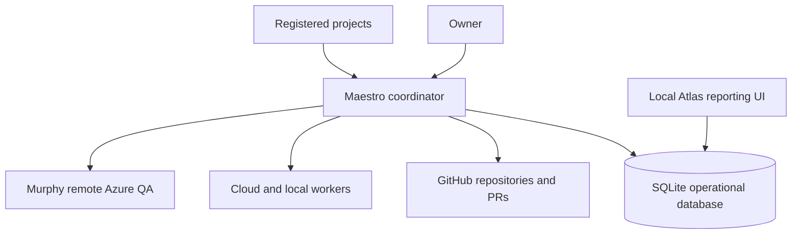
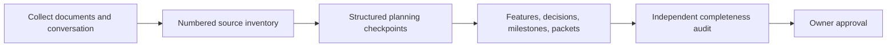
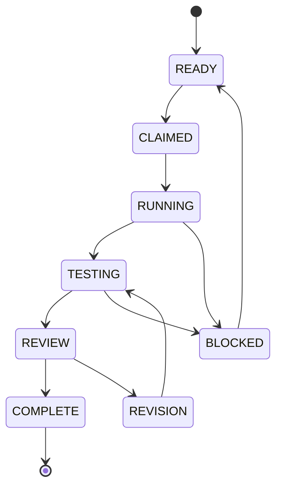

# Maestro Alpha 1 — Planning Capture, Action Report, and Handoff

**Status:** Planning capture — not approved for implementation  
**Repository:** `jmiedreich-ux/Maestro`  
**Current branch:** `master`  
**Last updated:** 2026-08-27

## Purpose

This report turns the Alpha 1 planning conversation into durable, actionable planning material. It combines:

1. `sources/planning/maestro-alpha-1-session.txt`
2. `sources/planning/local-agent-notes.md`
3. VennueSign's proposed Maestro design: `docs/design/proposed/maestro-dev-lead-agent-framework.md`
4. The existing Atlas repository: `jmiedreich-ux/Atlas`

This is a capture and handoff document. It is not permission to build the coordinator yet.

## Plain-language outcome

Maestro becomes the project-neutral development-operations system for the AI box.

It will eventually provide:

- A durable coordinator for milestones, packets, workers, reviews, verification, and recovery.
- A SQLite operational database for one-box operation.
- Atlas as the local reporting interface reading Maestro's database.
- Project registration and bootstrap for VennueSign, Foundry, and future projects.
- Cloud-to-local task routing with the planned executor and reviewer visible before work starts.
- Murphy as a separate remote Azure QA capability.
- Consistent planning records so important requirements and decisions from conversations cannot disappear.

## Target architecture

The AI box hosts Maestro, SQLite, the local Atlas reporting UI, local models, worktrees, build tools, and verification tools. No public dashboard or inbound internet endpoint is required for the initial system.

## Authority boundaries

| Area | Authority |
|---|---|
| Product requirements and design decisions | Owner-approved project records |
| Source code, branches, PRs, reviews, and CI | GitHub/project repository |
| Execution state, leases, attempts, evidence, timings, retries, and notifications | Maestro database |
| Reporting view | Atlas projection of Maestro database data |
| Azure deployed-environment QA | Murphy, under project policy |
| Final acceptance, merge, and deployment | Owner |

The database must not become a second unrelated source of truth for product requirements. Maestro synchronizes repository/GitHub facts into operational state; Atlas reads the operational state.

## Planning rules to preserve

Every planning input must be classified as one of:

- Requirement
- Decision
- Constraint or non-goal
- Open question
- Task candidate
- Deferred item

Every item must trace to a durable record. Nothing may disappear into a prose summary.

Every feature and milestone must use consistent structured records:

| Record | Required content |
|---|---|
| Feature brief | Outcome, users, non-goals, acceptance, owner, approval |
| Question | ID, exact question, owner, status, resolution/evidence |
| Decision | Context, options, choice, reason, consequences |
| Milestone | Outcome, exit condition, dependencies, risks |
| Task/packet | Plain subject, outcome, owner, allowed paths, interfaces, invariants, commands, reviewer, route |
| Coverage | Every required behavior mapped to a check or explicit `UNTESTED` reason |

Task titles must be short and plainly worded. Supporting explanation belongs in the task body.

Every roadmap task must show its planned route before execution:

- Execution location: local, cloud, or remote environment.
- Agent type: coordinator, implementation, specification, reviewer, QA, or other defined role.
- Model class or selected model.
- Independent reviewer.
- Validation commands.
- Dependencies and risk.

Planned routing and actual run facts are separate. Actual facts are recorded automatically when work begins; the user should never have to wait to learn the intended assignment.

## Planning-session capture process

At natural checkpoints, Maestro must record:

- Recorded decisions
- New requirements
- Changed milestones or tasks
- Open questions
- Explicit deferrals
- Source coverage
- Conflicts or items needing owner confirmation

Before implementation begins, an independent planning auditor compares every source item with the actual plan. Each source item must point to a requirement, decision, task, question, or explicit deferral.

## Development execution lifecycle

One run handles one owner-approved milestone. It creates one controlled draft PR, completes its review and verification gates, prepares the acceptance record, and stops. Automatic progression across multiple milestones is not part of the initial boundary.

Local workers receive suitable bounded work. Cloud coordination remains responsible for planning, architecture, contracts, integration, high-judgment work, and independent review. Local workers do not redesign requirements, approve their own work, merge, deploy, or make product decisions.

## Task routing

Initial routing is configuration, not a permanent model decision.

| Work | Default route |
|---|---|
| Mechanical documentation, indexing, scaffolding, focused tests | Local fast worker |
| Bounded multi-file implementation and difficult contained defects | Local developer worker |
| Contracts, migrations, cross-cutting integration, unresolved ambiguity | Cloud |
| Planning, architecture, security, identity, final review | Cloud |
| Deployed Azure environment QA | Murphy, remote Azure |
| Independent review | Different model/vendor from author when practical |

The current evidence says Qwen 3.6 27B is the proven local implementation model from the six-packet run. The VennueSign design names `qwen3-coder:30b`, `gpt-oss:20b`, and `qwen3.5:9b-q4_K_M`. Before implementation, resolve whether these are model-tag differences, test-era differences, or a stale routing table.

Only one local inference job runs at a time until capacity evidence supports concurrency.

## Worker enforcement wrapper

The local model must not be trusted to self-report that a packet is complete. Maestro needs an enforcement wrapper around every local execution. The wrapper runs the worker, then mechanically checks the result against the packet contract:

- **Scope:** `git diff --name-only` contains only allowed paths.
- **Build:** run `npm run build` and `npm exec tsc -- --noEmit` where applicable. The type-check closes the gap where an unintegrated file can avoid the normal build.
- **Commit:** verify that a real commit exists; do not trust the model's completion message.
- **Invariants:** run packet-specific checks such as required providers being rendered, no duplicate `#root`, valid markup, and required focus styles.
- **Evidence:** retain commands, outputs, changed files, commit SHA, model/runtime fingerprint, and disposition.

The wrapper allows one bounded rework cycle. On failure, it sends the worker the exact failed check. If the second attempt fails, Maestro escalates to cloud review or takeover. It does not start an endless repair loop.

Planned helper capabilities are:

- Preflight ping before spending a real attempt.
- Permission lock restricting writes to allowed paths.
- Runaway timeout and safe termination.
- Automatic performance-ledger entry.
- Model/context/quant fingerprinting.
- Fake-completion detection from the agent event stream.
- Packet linter that checks prompts for explicit paths, prohibitions, and existing-context references.
- Fresh worktree per attempt.
- Context-length hard gate.
- Unattended execution lock with closed stdin.
- Session export beside the evidence record.

The wrapper enforces format, scope, and repeatable checks. It cannot replace cloud judgment about architecture or whether the requirement itself is correct.

## Durable coordinator requirements

The coordinator must not depend on an open chat turn.

It needs:

- Durable task and milestone state.
- Explicit leases and locks.
- Idempotent transitions.
- Reboot and crash recovery.
- Known waiting state, awaited worker, expected result, timeout, and next permitted action.
- Polling first; webhooks may be added later.
- Bounded retries and revision cycles.
- Resource serialization between inference, builds, Playwright, and database containers.
- Independent notifications.
- Append-only execution evidence.
- Secret scanning before evidence is pushed.
- Protected branches and scoped credentials.

The first worker version is a one-box service using SQLite and a dedicated non-root user. It must not have production Azure credentials, customer data, automatic deployment permission, repository-administration permission, or sudo.

## Atlas integration and repository merge

Atlas is an existing public repository:

- Repository: `jmiedreich-ux/Atlas`
- Default branch: `main`
- Description: builds an always-current internal site from a project repository and GitHub
- Current technology shape includes Eleventy, `src`, `api`, `docs`, `fixture`, `tests`, and `theme`.

Atlas is not merely a reference. Its implementation must be inventoried and merged into Maestro as the local reporting surface.

The merge must be staged:

1. Inventory Atlas's source, build, tests, fixtures, theme, and GitHub Action.
2. Identify reusable reporting UI, parsing, rendering, and project-view components.
3. Define the Maestro database read boundary.
4. Adapt Atlas from repository/GitHub-derived reporting to Maestro database-backed reporting.
5. Preserve project-specific adapters and avoid embedding VennueSign assumptions.
6. Move the validated Atlas code into the Maestro repository under a clearly named reporting application area.
7. Retain attribution and history where practical.
8. Verify the merged application against fixtures and a real Maestro database.
9. Decide whether the standalone Atlas repository becomes archived, a compatibility shell, or remains temporarily maintained during migration.

Atlas must not be copied wholesale before this inventory. The goal is to preserve its useful reporting capability while changing its source from “read a project repository directly” to “read Maestro's structured operational data.”

## Murphy integration

Murphy remains a distinct remote QA capability in Azure.

Initial policy:

- Enabled as an integration.
- Trigger: manual or owner-approved.
- Target: deployed development/staging environment.
- Input: project, environment, deployed version/commit, and scoped QA credentials.
- Output: report artifact, reproducible findings, linked issues, and structured run result in Maestro's database.
- No automatic Murphy run after every deployment unless the project owner later approves that policy.

M0 must not contact Azure, use credentials, or change Murphy's current policy.

## Required M0 planning milestone

### M0-01 · Create Maestro project foundation

Register Maestro itself, establish controlled records, and document the repository structure.

**Planned route:** Cloud coordinator  
**Reviewer:** Independent cloud planning reviewer  
**Validation:** Repository structure and planning-record checks

### M0-02 · Capture planning sources and traceability

Inventory the Alpha 1 conversation, local-agent notes, VennueSign design, Atlas repository, and Murphy references. Number every meaningful source item and map it to the plan.

**Planned route:** Cloud planning lead  
**Reviewer:** Independent cloud planning auditor  
**Validation:** 100% source coverage or explicit deferral

### M0-03 · Define shared process and planning contract

Define schemas/templates for projects, foundation records, features, questions, decisions, milestones, tasks, packets, coverage, reviews, and handoffs.

**Planned route:** Cloud architecture/planning lead  
**Reviewer:** Independent cloud planning auditor  
**Validation:** Template/schema completeness and example records

### M0-04 · Define Maestro architecture and integrations

Define the coordinator, SQLite model, local Atlas reporting boundary, GitHub adapter, worker adapter, project bootstrap/register flow, and Murphy adapter.

**Planned route:** Cloud architecture/planning lead  
**Reviewer:** Independent cloud architecture reviewer  
**Validation:** Architecture review, data ownership table, and failure-path review

### M0-05 · Audit plan completeness and obtain owner acceptance

Check that every source item, decision, diagram, qualifier, and required action is represented and that no implementation begins without acceptance.

**Planned route:** Independent cloud planning auditor  
**Reviewer:** Owner  
**Validation:** Traceability report and owner acceptance

### M0-06 · Inventory and merge Atlas into Maestro reporting

Perform the Atlas repository inventory and produce the migration design and first bounded merge packet. This is planning and inventory first; code migration follows owner approval.

**Planned route:** Cloud architecture lead for migration design; local developer worker for bounded mechanical migration after approval  
**Reviewer:** Independent cloud reviewer  
**Validation:** Atlas inventory, dependency map, database boundary, fixture coverage, and migration decision

## Later implementation sequence

### v1 — Prove the control loop

- One hosted/cloud coordinator.
- One registered project.
- One owner-approved bounded milestone.
- Durable SQLite run state.
- One worker assignment.
- One draft PR.
- Verification and evidence.
- Cloud review.
- Owner acceptance and merge unchanged.

### v2 — Controlled delegation

- Local worker polling and leases.
- Isolated worktrees.
- Packet ownership enforcement.
- Model-routing configuration.
- Local implementation and test work.
- Atlas reads the live local Maestro database.

### v3 — Mature execution support

- Independent review and bounded revision.
- Reboot/crash recovery.
- Murphy integration.
- QA hooks and retrospective issues.
- Disposable SQL Server container gate.
- Linux-native verification.
- Stronger authentication and resource controls.

## Open decisions

1. Confirm Maestro as the final repository and system name.
2. Confirm the model tags and routing table after reconciling the qualification evidence.
3. Decide where the shared planning schemas live within Maestro.
4. Decide whether Atlas is moved under `apps/atlas`, `src/reporting`, or another boundary.
5. Decide how Atlas history and the standalone repository are handled after migration.
6. Decide the SQLite backup and restore policy.
7. Decide the maximum review/revision count before cloud or owner escalation.
8. Decide whether the first verification gate uses the Windows development box or begins directly with Linux-native tooling.
9. Decide the resource policy for local inference versus builds, browsers, and database containers.

## Handoff — exact next action

Do not build the runner yet.

Create the numbered source inventory and traceability map first, covering:

- The full `maestro-alpha-1-session.txt`.
- `local-agent-notes.md`.
- VennueSign's Maestro design.
- The Atlas repository and its current structure.
- Murphy's project-specific QA contract and current manual-trigger constraint.

Present that inventory for owner review. After approval, produce the M0-03/M0-04 planning records, then prepare the Atlas migration inventory as M0-06.
